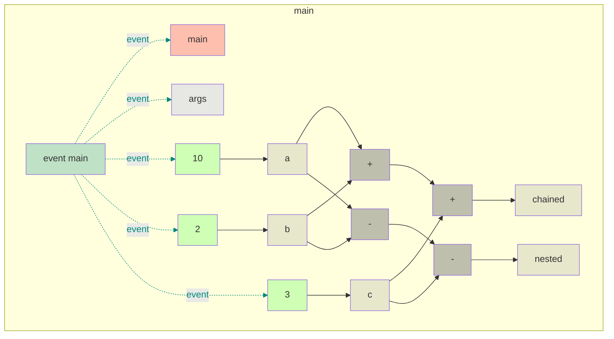

```mermaid
flowchart TD
  subgraph b0["main"]
    n1[event main]:::EVENT
    n2[main]:::RETURN
    n3[args]:::FUNC_PARAM
    n4[10]:::LITERAL
    n5[a]:::VARIABLE
    n6[2]:::LITERAL
    n7[b]:::VARIABLE
    n8[3]:::LITERAL
    n9[c]:::VARIABLE
    n10[+]:::BIN_OP
    n11[+]:::BIN_OP
    n12[chained]:::VARIABLE
    n13[-]:::BIN_OP
    n14[-]:::BIN_OP
    n15[nested]:::VARIABLE
    n1[event main]:::EVENT -. event .-> n2[main]:::RETURN
    n1[event main]:::EVENT -. event .-> n3[args]:::FUNC_PARAM
    n1[event main]:::EVENT -. event .-> n4[10]:::LITERAL
    n1[event main]:::EVENT -. event .-> n6[2]:::LITERAL
    n1[event main]:::EVENT -. event .-> n8[3]:::LITERAL
    n4[10]:::LITERAL --> n5[a]:::VARIABLE
    n5[a]:::VARIABLE --> n10[+]:::BIN_OP
    n5[a]:::VARIABLE --> n13[-]:::BIN_OP
    n6[2]:::LITERAL --> n7[b]:::VARIABLE
    n7[b]:::VARIABLE --> n10[+]:::BIN_OP
    n7[b]:::VARIABLE --> n13[-]:::BIN_OP
    n8[3]:::LITERAL --> n9[c]:::VARIABLE
    n9[c]:::VARIABLE --> n11[+]:::BIN_OP
    n9[c]:::VARIABLE --> n14[-]:::BIN_OP
    n10[+]:::BIN_OP --> n11[+]:::BIN_OP
    n11[+]:::BIN_OP --> n12[chained]:::VARIABLE
    n13[-]:::BIN_OP --> n14[-]:::BIN_OP
    n14[-]:::BIN_OP --> n15[nested]:::VARIABLE
  end
  linkStyle 0 stroke:#00897b,color:#00897b
  linkStyle 1 stroke:#00897b,color:#00897b
  linkStyle 2 stroke:#00897b,color:#00897b
  linkStyle 3 stroke:#00897b,color:#00897b
  linkStyle 4 stroke:#00897b,color:#00897b
  classDef LITERAL fill:#00FF0030
  classDef VARIABLE fill:#80808030
  classDef BIN_OP fill:#80808080
  classDef FUNC_PARAM fill:#8080FF30
  classDef RETURN fill:#FF808080
  classDef EXTERNAL fill:#FFA50040
  classDef UNMODELLED fill:#FF000030,stroke-dasharray: 4 2
  classDef EVENT fill:#00897B40
```
