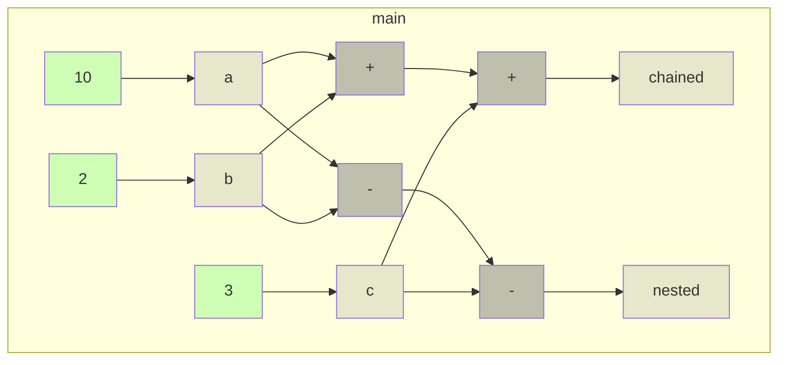

# chainedBinOp: spike value graph (condensed)

```mermaid
flowchart TD
  subgraph m0["main"]
    n0["+"]:::BIN_OP
    n1["+"]:::BIN_OP
    n2["-"]:::BIN_OP
    n3["-"]:::BIN_OP
    n4["10"]:::LITERAL
    n5["2"]:::LITERAL
    n6["3"]:::LITERAL
    n7["a"]:::VARIABLE
    n8["b"]:::VARIABLE
    n9["c"]:::VARIABLE
    n10["chained"]:::VARIABLE
    n11["nested"]:::VARIABLE
  end
  n0 --> n10
  n1 --> n0
  n2 --> n11
  n3 --> n2
  n4 --> n7
  n5 --> n8
  n6 --> n9
  n7 --> n1
  n7 --> n3
  n8 --> n1
  n8 --> n3
  n9 --> n0
  n9 --> n2
  classDef LITERAL fill:#00FF0030
  classDef VARIABLE fill:#80808030
  classDef BIN_OP fill:#80808080
  classDef FUNC_PARAM fill:#8080FF30
  classDef RETURN fill:#FF808080
  classDef EXTERNAL fill:#FFA50040
  classDef UNMODELLED fill:#FF000030,stroke-dasharray: 4 2
```
