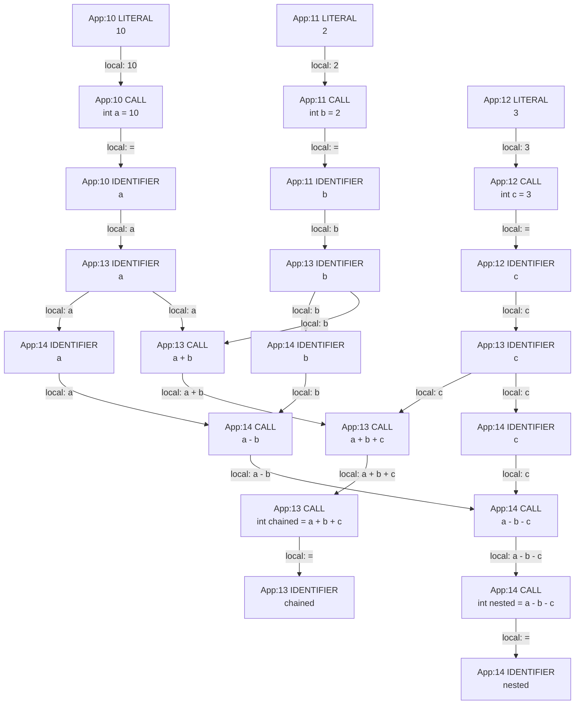

# chainedBinOp: spike value graph

```mermaid
flowchart TD
  n0["App:10 CALL<br/>int a = 10"]
  n1["App:10 IDENTIFIER<br/>a"]
  n2["App:10 LITERAL<br/>10"]
  n3["App:11 CALL<br/>int b = 2"]
  n4["App:11 IDENTIFIER<br/>b"]
  n5["App:11 LITERAL<br/>2"]
  n6["App:12 CALL<br/>int c = 3"]
  n7["App:12 IDENTIFIER<br/>c"]
  n8["App:12 LITERAL<br/>3"]
  n9["App:13 CALL<br/>a + b"]
  n10["App:13 CALL<br/>a + b + c"]
  n11["App:13 CALL<br/>int chained = a + b + c"]
  n12["App:13 IDENTIFIER<br/>a"]
  n13["App:13 IDENTIFIER<br/>b"]
  n14["App:13 IDENTIFIER<br/>c"]
  n15["App:13 IDENTIFIER<br/>chained"]
  n16["App:14 CALL<br/>a - b"]
  n17["App:14 CALL<br/>a - b - c"]
  n18["App:14 CALL<br/>int nested = a - b - c"]
  n19["App:14 IDENTIFIER<br/>a"]
  n20["App:14 IDENTIFIER<br/>b"]
  n21["App:14 IDENTIFIER<br/>c"]
  n22["App:14 IDENTIFIER<br/>nested"]
  n0 -->|"local: ="| n1
  n1 -->|"local: a"| n12
  n10 -->|"local: a + b + c"| n11
  n11 -->|"local: ="| n15
  n12 -->|"local: a"| n19
  n12 -->|"local: a"| n9
  n13 -->|"local: b"| n20
  n13 -->|"local: b"| n9
  n14 -->|"local: c"| n10
  n14 -->|"local: c"| n21
  n16 -->|"local: a - b"| n17
  n17 -->|"local: a - b - c"| n18
  n18 -->|"local: ="| n22
  n19 -->|"local: a"| n16
  n2 -->|"local: 10"| n0
  n20 -->|"local: b"| n16
  n21 -->|"local: c"| n17
  n3 -->|"local: ="| n4
  n4 -->|"local: b"| n13
  n5 -->|"local: 2"| n3
  n6 -->|"local: ="| n7
  n7 -->|"local: c"| n14
  n8 -->|"local: 3"| n6
  n9 -->|"local: a + b"| n10
```
