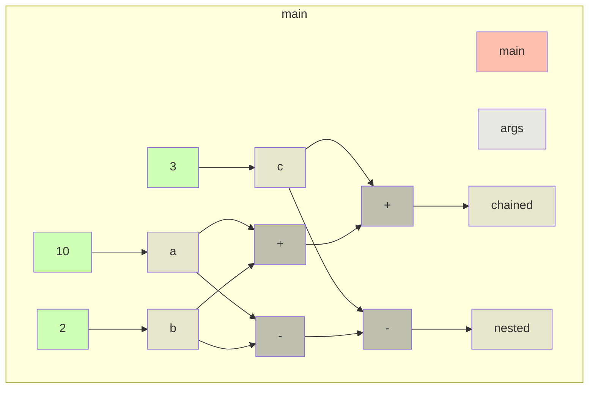

```mermaid
flowchart TD
  subgraph 4309014["main"]
    -16442918472[nested]:::VARIABLE
    56853577[main]:::RETURN
    234649357[args]:::FUNC_PARAM
    1389021585[a]:::VARIABLE
    1389049586[b]:::VARIABLE
    1389050536[10]:::LITERAL
    1389053361[2]:::LITERAL
    1389077472[c]:::VARIABLE
    1389081247[3]:::LITERAL
    1389110877[+]:::BIN_OP
    1389110902[+]:::BIN_OP
    1389142682[-]:::BIN_OP
    1389142686[-]:::BIN_OP
    13948707992[chained]:::VARIABLE
    1389021585[a]:::VARIABLE --> 1389110877[+]:::BIN_OP
    1389021585[a]:::VARIABLE --> 1389142682[-]:::BIN_OP
    1389049586[b]:::VARIABLE --> 1389110877[+]:::BIN_OP
    1389049586[b]:::VARIABLE --> 1389142682[-]:::BIN_OP
    1389050536[10]:::LITERAL --> 1389021585[a]:::VARIABLE
    1389053361[2]:::LITERAL --> 1389049586[b]:::VARIABLE
    1389077472[c]:::VARIABLE --> 1389110902[+]:::BIN_OP
    1389077472[c]:::VARIABLE --> 1389142686[-]:::BIN_OP
    1389081247[3]:::LITERAL --> 1389077472[c]:::VARIABLE
    1389110877[+]:::BIN_OP --> 1389110902[+]:::BIN_OP
    1389110902[+]:::BIN_OP --> 13948707992[chained]:::VARIABLE
    1389142682[-]:::BIN_OP --> 1389142686[-]:::BIN_OP
    1389142686[-]:::BIN_OP --> -16442918472[nested]:::VARIABLE
  end
  classDef LITERAL fill:#00FF0030
  classDef VARIABLE fill:#80808030
  classDef BIN_OP fill:#80808080
  classDef FUNC_PARAM fill:#8080FF30
  classDef RETURN fill:#FF808080
```
