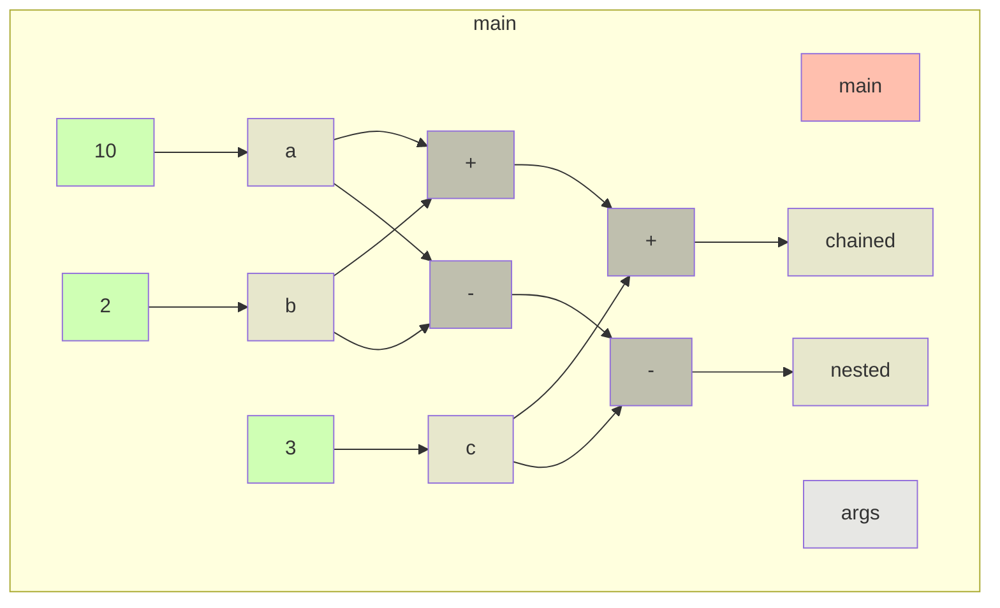

```mermaid
flowchart TD
  subgraph b0["main"]
    n1[main]:::RETURN
    n2[args]:::FUNC_PARAM
    n3[10]:::LITERAL
    n4[a]:::VARIABLE
    n5[2]:::LITERAL
    n6[b]:::VARIABLE
    n7[3]:::LITERAL
    n8[c]:::VARIABLE
    n9[+]:::BIN_OP
    n10[+]:::BIN_OP
    n11[chained]:::VARIABLE
    n12[-]:::BIN_OP
    n13[-]:::BIN_OP
    n14[nested]:::VARIABLE
    n3[10]:::LITERAL --> n4[a]:::VARIABLE
    n4[a]:::VARIABLE --> n9[+]:::BIN_OP
    n4[a]:::VARIABLE --> n12[-]:::BIN_OP
    n5[2]:::LITERAL --> n6[b]:::VARIABLE
    n6[b]:::VARIABLE --> n9[+]:::BIN_OP
    n6[b]:::VARIABLE --> n12[-]:::BIN_OP
    n7[3]:::LITERAL --> n8[c]:::VARIABLE
    n8[c]:::VARIABLE --> n10[+]:::BIN_OP
    n8[c]:::VARIABLE --> n13[-]:::BIN_OP
    n9[+]:::BIN_OP --> n10[+]:::BIN_OP
    n10[+]:::BIN_OP --> n11[chained]:::VARIABLE
    n12[-]:::BIN_OP --> n13[-]:::BIN_OP
    n13[-]:::BIN_OP --> n14[nested]:::VARIABLE
  end
  classDef LITERAL fill:#00FF0030
  classDef VARIABLE fill:#80808030
  classDef BIN_OP fill:#80808080
  classDef FUNC_PARAM fill:#8080FF30
  classDef RETURN fill:#FF808080
  classDef EXTERNAL fill:#FFA50040
  classDef UNMODELLED fill:#FF000030,stroke-dasharray: 4 2
```
