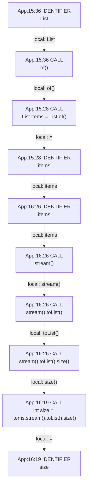

# chainedCall: spike value graph

```mermaid
flowchart TD
  n0["App:15:28 CALL<br/>List items = List.of()"]
  n1["App:15:28 IDENTIFIER<br/>items"]
  n2["App:15:36 CALL<br/>of()"]
  n3["App:15:36 IDENTIFIER<br/>List"]
  n4["App:16:19 CALL<br/>int size = items.stream().toList().size()"]
  n5["App:16:19 IDENTIFIER<br/>size"]
  n6["App:16:26 CALL<br/>stream()"]
  n7["App:16:26 CALL<br/>stream().toList()"]
  n8["App:16:26 CALL<br/>stream().toList().size()"]
  n9["App:16:26 IDENTIFIER<br/>items"]
  n0 -->|"local: ="| n1
  n1 -->|"local: items"| n9
  n2 -->|"local: of()"| n0
  n3 -->|"local: List"| n2
  n4 -->|"local: ="| n5
  n6 -->|"local: stream()"| n7
  n7 -->|"local: toList()"| n8
  n8 -->|"local: size()"| n4
  n9 -->|"local: items"| n6
```
