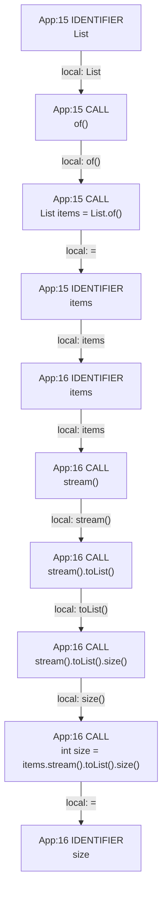

# chainedCall: spike value graph

```mermaid
flowchart TD
  n0["App:15 CALL<br/>List items = List.of()"]
  n1["App:15 CALL<br/>of()"]
  n2["App:15 IDENTIFIER<br/>List"]
  n3["App:15 IDENTIFIER<br/>items"]
  n4["App:16 CALL<br/>int size = items.stream().toList().size()"]
  n5["App:16 CALL<br/>stream()"]
  n6["App:16 CALL<br/>stream().toList()"]
  n7["App:16 CALL<br/>stream().toList().size()"]
  n8["App:16 IDENTIFIER<br/>items"]
  n9["App:16 IDENTIFIER<br/>size"]
  n0 -->|"local: ="| n3
  n1 -->|"local: of()"| n0
  n2 -->|"local: List"| n1
  n3 -->|"local: items"| n8
  n4 -->|"local: ="| n9
  n5 -->|"local: stream()"| n6
  n6 -->|"local: toList()"| n7
  n7 -->|"local: size()"| n4
  n8 -->|"local: items"| n5
```
