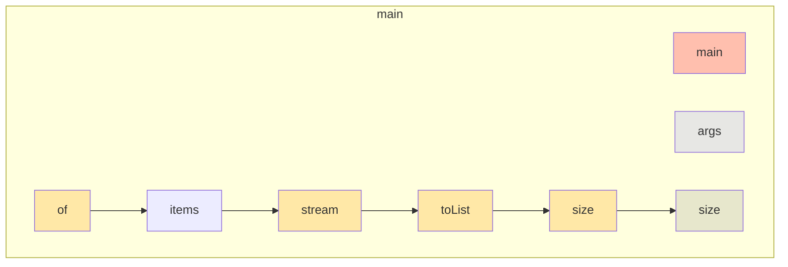

```mermaid
flowchart TD
  subgraph 4309014["main"]
    -14919308514[stream]:::EXTERNAL
    -14530282235[toList]:::EXTERNAL
    56853577[main]:::RETURN
    244553230[of]:::EXTERNAL
    295442462[args]:::FUNC_PARAM
    304541899[size]:::VARIABLE
    304547444[size]:::EXTERNAL
    1953406652[items]:::OBJ_VARIABLE
    -14919308514[stream]:::EXTERNAL --> -14530282235[toList]:::EXTERNAL
    -14530282235[toList]:::EXTERNAL --> 304547444[size]:::EXTERNAL
    244553230[of]:::EXTERNAL --> 1953406652[items]:::OBJ_VARIABLE
    304547444[size]:::EXTERNAL --> 304541899[size]:::VARIABLE
    1953406652[items]:::OBJ_VARIABLE --> -14919308514[stream]:::EXTERNAL
  end
  classDef LITERAL fill:#00FF0030
  classDef VARIABLE fill:#80808030
  classDef BIN_OP fill:#80808080
  classDef FUNC_PARAM fill:#8080FF30
  classDef RETURN fill:#FF808080
  classDef EXTERNAL fill:#FFA50040
```
