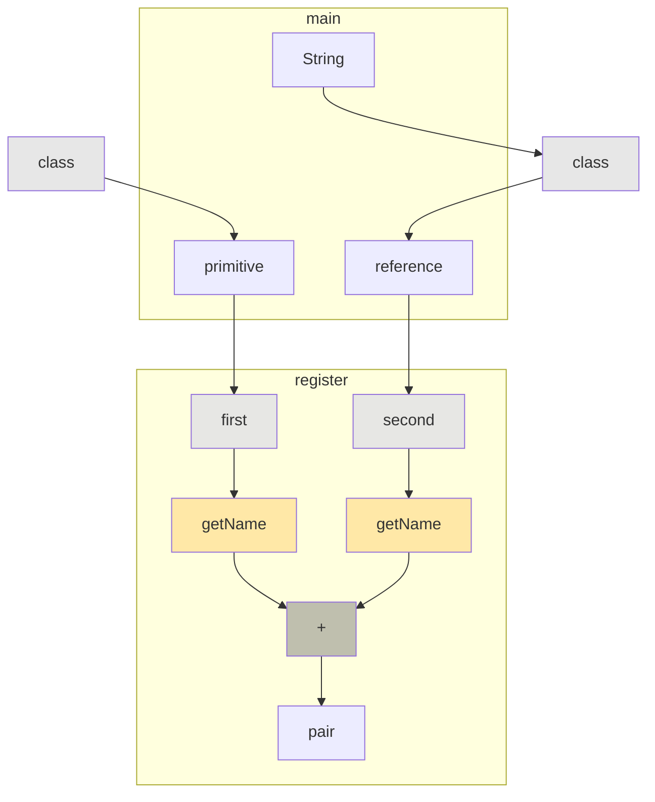

# classLiteral: spike value graph (condensed)

```mermaid
flowchart TD
  subgraph m0["main"]
    n0["String"]:::OBJ_VARIABLE
    n1["primitive"]:::OBJ_VARIABLE
    n2["reference"]:::OBJ_VARIABLE
  end
  subgraph m1["register"]
    n3["+"]:::BIN_OP
    n4["getName"]:::EXTERNAL
    n5["getName"]:::EXTERNAL
    n6["first"]:::FUNC_PARAM
    n7["second"]:::FUNC_PARAM
    n8["pair"]:::OBJ_VARIABLE
  end
  n9["class"]:::VARIABLE
  n10["class"]:::VARIABLE
  n0 --> n9
  n1 --> n6
  n10 --> n1
  n2 --> n7
  n3 --> n8
  n4 --> n3
  n5 --> n3
  n6 --> n4
  n7 --> n5
  n9 --> n2
  classDef LITERAL fill:#00FF0030
  classDef VARIABLE fill:#80808030
  classDef BIN_OP fill:#80808080
  classDef FUNC_PARAM fill:#8080FF30
  classDef RETURN fill:#FF808080
  classDef EXTERNAL fill:#FFA50040
  classDef UNMODELLED fill:#FF000030,stroke-dasharray: 4 2
```
