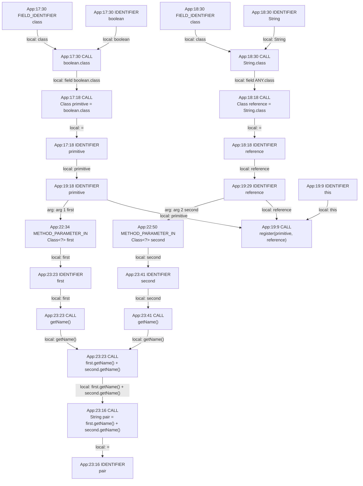

# classLiteral: spike value graph

```mermaid
flowchart TD
  n0["App:17:18 CALL<br/>Class primitive = boolean.class"]
  n1["App:17:18 IDENTIFIER<br/>primitive"]
  n2["App:17:30 CALL<br/>boolean.class"]
  n3["App:17:30 FIELD_IDENTIFIER<br/>class"]
  n4["App:17:30 IDENTIFIER<br/>boolean"]
  n5["App:18:18 CALL<br/>Class reference = String.class"]
  n6["App:18:18 IDENTIFIER<br/>reference"]
  n7["App:18:30 CALL<br/>String.class"]
  n8["App:18:30 FIELD_IDENTIFIER<br/>class"]
  n9["App:18:30 IDENTIFIER<br/>String"]
  n10["App:19:18 IDENTIFIER<br/>primitive"]
  n11["App:19:29 IDENTIFIER<br/>reference"]
  n12["App:19:9 CALL<br/>register(primitive, reference)"]
  n13["App:19:9 IDENTIFIER<br/>this"]
  n14["App:22:34 METHOD_PARAMETER_IN<br/>Class#lt;?#gt; first"]
  n15["App:22:50 METHOD_PARAMETER_IN<br/>Class#lt;?#gt; second"]
  n16["App:23:16 CALL<br/>String pair = first.getName() + second.getName()"]
  n17["App:23:16 IDENTIFIER<br/>pair"]
  n18["App:23:23 CALL<br/>first.getName() + second.getName()"]
  n19["App:23:23 CALL<br/>getName()"]
  n20["App:23:23 IDENTIFIER<br/>first"]
  n21["App:23:41 CALL<br/>getName()"]
  n22["App:23:41 IDENTIFIER<br/>second"]
  n0 -->|"local: ="| n1
  n1 -->|"local: primitive"| n10
  n10 -->|"arg: arg 1 first"| n14
  n10 -->|"local: primitive"| n12
  n11 -->|"arg: arg 2 second"| n15
  n11 -->|"local: reference"| n12
  n13 -->|"local: this"| n12
  n14 -->|"local: first"| n20
  n15 -->|"local: second"| n22
  n16 -->|"local: ="| n17
  n18 -->|"local: first.getName() + second.getName()"| n16
  n19 -->|"local: getName()"| n18
  n2 -->|"local: field boolean.class"| n0
  n20 -->|"local: first"| n19
  n21 -->|"local: getName()"| n18
  n22 -->|"local: second"| n21
  n3 -->|"local: class"| n2
  n4 -->|"local: boolean"| n2
  n5 -->|"local: ="| n6
  n6 -->|"local: reference"| n11
  n7 -->|"local: field ANY.class"| n5
  n8 -->|"local: class"| n7
  n9 -->|"local: String"| n7
```
