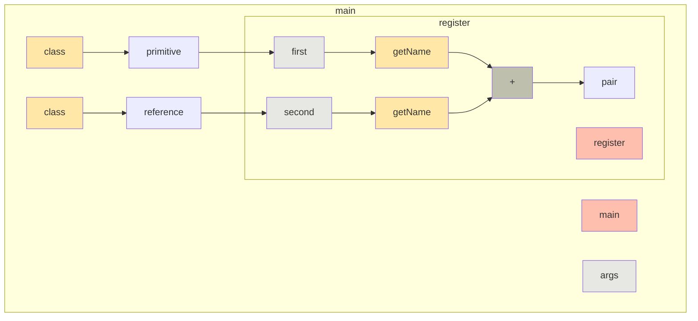

```mermaid
flowchart TD
  subgraph b0["main"]
    n1[main]:::RETURN
    n2[args]:::FUNC_PARAM
    n3[class]:::EXTERNAL
    n4[primitive]:::OBJ_VARIABLE
    n5[class]:::EXTERNAL
    n6[reference]:::OBJ_VARIABLE
    n3[class]:::EXTERNAL --> n4[primitive]:::OBJ_VARIABLE
    n4[primitive]:::OBJ_VARIABLE --> n9[first]:::FUNC_PARAM
    n5[class]:::EXTERNAL --> n6[reference]:::OBJ_VARIABLE
    n6[reference]:::OBJ_VARIABLE --> n10[second]:::FUNC_PARAM
    subgraph b7["register"]
      n8[register]:::RETURN
      n9[first]:::FUNC_PARAM
      n10[second]:::FUNC_PARAM
      n11[getName]:::EXTERNAL
      n12[getName]:::EXTERNAL
      n13[+]:::BIN_OP
      n14[pair]:::OBJ_VARIABLE
      n9[first]:::FUNC_PARAM --> n11[getName]:::EXTERNAL
      n10[second]:::FUNC_PARAM --> n12[getName]:::EXTERNAL
      n11[getName]:::EXTERNAL --> n13[+]:::BIN_OP
      n12[getName]:::EXTERNAL --> n13[+]:::BIN_OP
      n13[+]:::BIN_OP --> n14[pair]:::OBJ_VARIABLE
    end
  end
  classDef LITERAL fill:#00FF0030
  classDef VARIABLE fill:#80808030
  classDef BIN_OP fill:#80808080
  classDef FUNC_PARAM fill:#8080FF30
  classDef RETURN fill:#FF808080
  classDef EXTERNAL fill:#FFA50040
  classDef UNMODELLED fill:#FF000030,stroke-dasharray: 4 2
```
