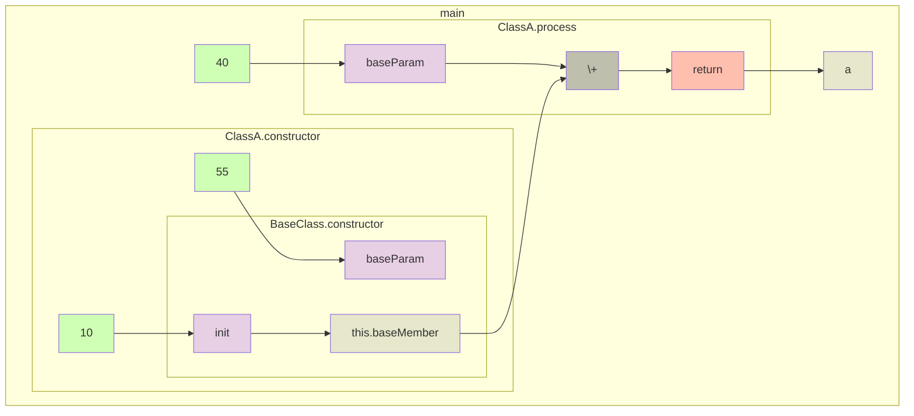

```mermaid
flowchart TD
  subgraph sub1["main"]
    40[40]:::LITERAL --> baseParam[baseParam]:::FUNC_PARAM
    subgraph sub2["ClassA.constructor"]
        10[10]:::LITERAL --> init[init]:::FUNC_PARAM
        55[55]:::LITERAL --> baseParam2[baseParam]:::FUNC_PARAM
        subgraph sub3["BaseClass.constructor"]
            init[init]:::FUNC_PARAM --> bm[this.baseMember]:::VARIABLE
            baseParam2[baseParam]:::FUNC_PARAM
        end
    end
    subgraph sub4["ClassA.process"]
        baseParam[baseParam]:::FUNC_PARAM --> binop1["\+"]:::BIN_OP
        bm[this.baseMember]:::VARIABLE --> binop1["\+"]:::BIN_OP
        binop1["\+"]:::BIN_OP --> return1["ClassA.process"]:::RETURN
    end
    a:::VARIABLE
    return1["return"]:::RETURN --> a
  end
  classDef LITERAL fill:#00FF0030
  classDef VARIABLE fill:#80808030
  classDef BIN_OP fill:#80808080
  classDef FUNC_PARAM fill:#8000FF30
  classDef RETURN fill:#FF808080
```
