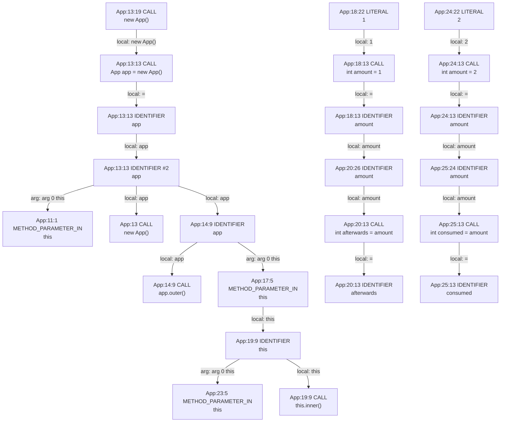

# collidingLocals: spike value graph

```mermaid
flowchart TD
  n0["App:11:1 METHOD_PARAMETER_IN<br/>this"]
  n1["App:13 CALL<br/>new App()"]
  n2["App:13:13 CALL<br/>App app = new App()"]
  n3["App:13:13 IDENTIFIER #2<br/>app"]
  n4["App:13:13 IDENTIFIER<br/>app"]
  n5["App:13:19 CALL<br/>new App()"]
  n6["App:14:9 CALL<br/>app.outer()"]
  n7["App:14:9 IDENTIFIER<br/>app"]
  n8["App:17:5 METHOD_PARAMETER_IN<br/>this"]
  n9["App:18:13 CALL<br/>int amount = 1"]
  n10["App:18:13 IDENTIFIER<br/>amount"]
  n11["App:18:22 LITERAL<br/>1"]
  n12["App:19:9 CALL<br/>this.inner()"]
  n13["App:19:9 IDENTIFIER<br/>this"]
  n14["App:20:13 CALL<br/>int afterwards = amount"]
  n15["App:20:13 IDENTIFIER<br/>afterwards"]
  n16["App:20:26 IDENTIFIER<br/>amount"]
  n17["App:23:5 METHOD_PARAMETER_IN<br/>this"]
  n18["App:24:13 CALL<br/>int amount = 2"]
  n19["App:24:13 IDENTIFIER<br/>amount"]
  n20["App:24:22 LITERAL<br/>2"]
  n21["App:25:13 CALL<br/>int consumed = amount"]
  n22["App:25:13 IDENTIFIER<br/>consumed"]
  n23["App:25:24 IDENTIFIER<br/>amount"]
  n10 -->|"local: amount"| n16
  n11 -->|"local: 1"| n9
  n13 -->|"arg: arg 0 this"| n17
  n13 -->|"local: this"| n12
  n14 -->|"local: ="| n15
  n16 -->|"local: amount"| n14
  n18 -->|"local: ="| n19
  n19 -->|"local: amount"| n23
  n2 -->|"local: ="| n4
  n20 -->|"local: 2"| n18
  n21 -->|"local: ="| n22
  n23 -->|"local: amount"| n21
  n3 -->|"arg: arg 0 this"| n0
  n3 -->|"local: app"| n1
  n3 -->|"local: app"| n7
  n4 -->|"local: app"| n3
  n5 -->|"local: new App()"| n2
  n7 -->|"arg: arg 0 this"| n8
  n7 -->|"local: app"| n6
  n8 -->|"local: this"| n13
  n9 -->|"local: ="| n10
```
