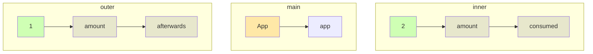

# collidingLocals: spike value graph (condensed)

```mermaid
flowchart TD
  subgraph m0["inner"]
    n0["2"]:::LITERAL
    n1["amount"]:::VARIABLE
    n2["consumed"]:::VARIABLE
  end
  subgraph m1["main"]
    n3["App"]:::EXTERNAL
    n4["app"]:::OBJ_VARIABLE
  end
  subgraph m2["outer"]
    n5["1"]:::LITERAL
    n6["afterwards"]:::VARIABLE
    n7["amount"]:::VARIABLE
  end
  n0 --> n1
  n1 --> n2
  n3 --> n4
  n5 --> n7
  n7 --> n6
  classDef LITERAL fill:#00FF0030
  classDef VARIABLE fill:#80808030
  classDef BIN_OP fill:#80808080
  classDef FUNC_PARAM fill:#8080FF30
  classDef RETURN fill:#FF808080
  classDef EXTERNAL fill:#FFA50040
  classDef UNMODELLED fill:#FF000030,stroke-dasharray: 4 2
```
