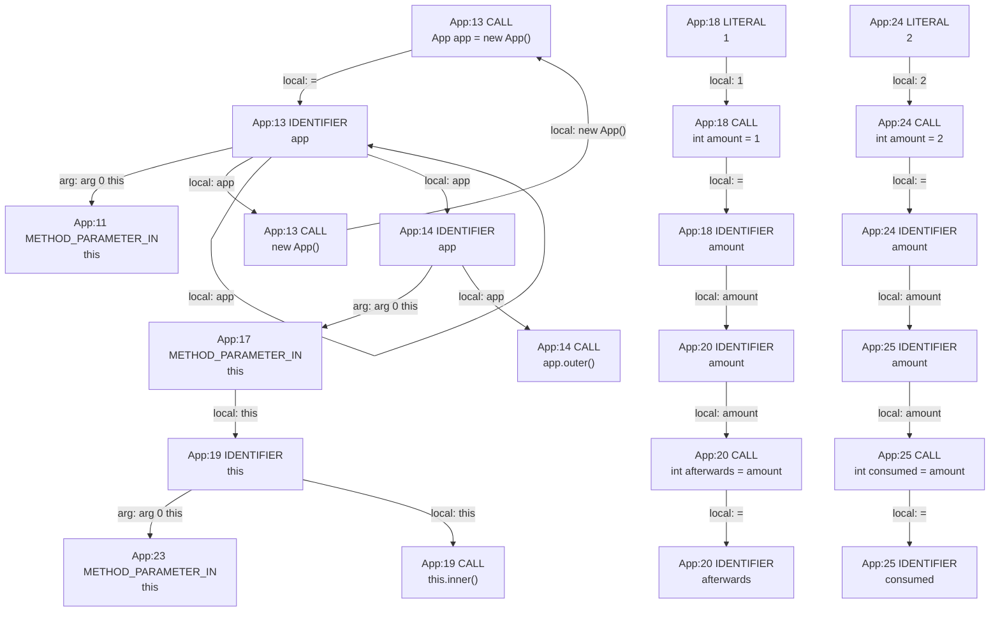

# collidingLocals: spike value graph

```mermaid
flowchart TD
  n0["App:11 METHOD_PARAMETER_IN<br/>this"]
  n1["App:13 CALL<br/>App app = new App()"]
  n2["App:13 CALL<br/>new App()"]
  n3["App:13 IDENTIFIER<br/>app"]
  n4["App:14 CALL<br/>app.outer()"]
  n5["App:14 IDENTIFIER<br/>app"]
  n6["App:17 METHOD_PARAMETER_IN<br/>this"]
  n7["App:18 CALL<br/>int amount = 1"]
  n8["App:18 IDENTIFIER<br/>amount"]
  n9["App:18 LITERAL<br/>1"]
  n10["App:19 CALL<br/>this.inner()"]
  n11["App:19 IDENTIFIER<br/>this"]
  n12["App:20 CALL<br/>int afterwards = amount"]
  n13["App:20 IDENTIFIER<br/>afterwards"]
  n14["App:20 IDENTIFIER<br/>amount"]
  n15["App:23 METHOD_PARAMETER_IN<br/>this"]
  n16["App:24 CALL<br/>int amount = 2"]
  n17["App:24 IDENTIFIER<br/>amount"]
  n18["App:24 LITERAL<br/>2"]
  n19["App:25 CALL<br/>int consumed = amount"]
  n20["App:25 IDENTIFIER<br/>amount"]
  n21["App:25 IDENTIFIER<br/>consumed"]
  n1 -->|"local: ="| n3
  n11 -->|"arg: arg 0 this"| n15
  n11 -->|"local: this"| n10
  n12 -->|"local: ="| n13
  n14 -->|"local: amount"| n12
  n16 -->|"local: ="| n17
  n17 -->|"local: amount"| n20
  n18 -->|"local: 2"| n16
  n19 -->|"local: ="| n21
  n2 -->|"local: new App()"| n1
  n20 -->|"local: amount"| n19
  n3 -->|"arg: arg 0 this"| n0
  n3 -->|"local: app"| n2
  n3 -->|"local: app"| n3
  n3 -->|"local: app"| n5
  n5 -->|"arg: arg 0 this"| n6
  n5 -->|"local: app"| n4
  n6 -->|"local: this"| n11
  n7 -->|"local: ="| n8
  n8 -->|"local: amount"| n14
  n9 -->|"local: 1"| n7
```
