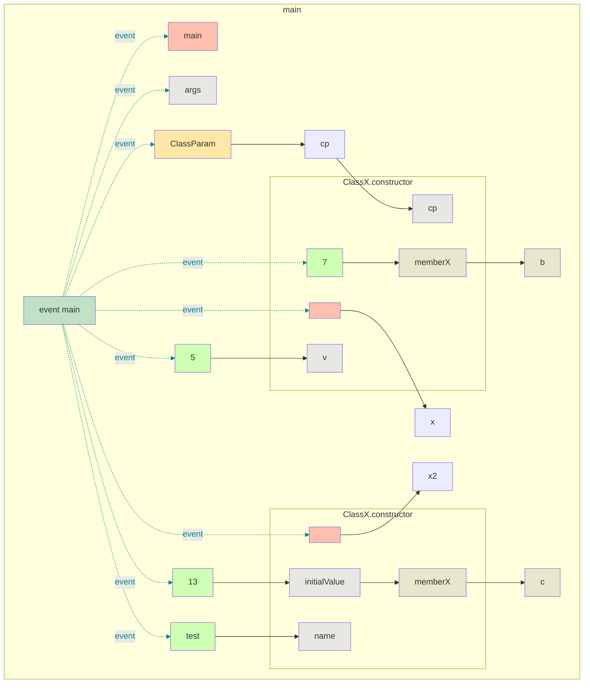

```mermaid
flowchart TD
  subgraph b0["main"]
    n1[event main]:::EVENT
    n2[main]:::RETURN
    n3[args]:::FUNC_PARAM
    n4[ClassParam]:::EXTERNAL
    n5[cp]:::OBJ_VARIABLE
    n6[5]:::LITERAL
    n13[x]:::OBJ_VARIABLE
    n14[b]:::VARIABLE
    n15[13]:::LITERAL
    n16["test"]:::LITERAL
    n22[x2]:::OBJ_VARIABLE
    n23[c]:::VARIABLE
    n1[event main]:::EVENT -. event .-> n2[main]:::RETURN
    n1[event main]:::EVENT -. event .-> n3[args]:::FUNC_PARAM
    n1[event main]:::EVENT -. event .-> n4[ClassParam]:::EXTERNAL
    n1[event main]:::EVENT -. event .-> n6[5]:::LITERAL
    n1[event main]:::EVENT -. event .-> n15[13]:::LITERAL
    n1[event main]:::EVENT -. event .-> n16["test"]:::LITERAL
    n1[event main]:::EVENT -. event .-> n8[<init>]:::RETURN
    n1[event main]:::EVENT -. event .-> n11[7]:::LITERAL
    n1[event main]:::EVENT -. event .-> n18[<init>]:::RETURN
    n4[ClassParam]:::EXTERNAL --> n5[cp]:::OBJ_VARIABLE
    n5[cp]:::OBJ_VARIABLE --> n10[cp]:::FUNC_PARAM
    n6[5]:::LITERAL --> n9[v]:::FUNC_PARAM
    n15[13]:::LITERAL --> n19[initialValue]:::FUNC_PARAM
    n16["test"]:::LITERAL --> n20[name]:::FUNC_PARAM
    n8[<init>]:::RETURN --> n13[x]:::OBJ_VARIABLE
    n12[memberX]:::VARIABLE --> n14[b]:::VARIABLE
    n18[<init>]:::RETURN --> n22[x2]:::OBJ_VARIABLE
    n21[memberX]:::VARIABLE --> n23[c]:::VARIABLE
    subgraph b7["ClassX.constructor"]
      n8[<init>]:::RETURN
      n9[v]:::FUNC_PARAM
      n10[cp]:::FUNC_PARAM
      n11[7]:::LITERAL
      n12[memberX]:::VARIABLE
      n11[7]:::LITERAL --> n12[memberX]:::VARIABLE
    end
    subgraph b17["ClassX.constructor"]
      n18[<init>]:::RETURN
      n19[initialValue]:::FUNC_PARAM
      n20[name]:::FUNC_PARAM
      n21[memberX]:::VARIABLE
      n19[initialValue]:::FUNC_PARAM --> n21[memberX]:::VARIABLE
    end
  end
  linkStyle 0 stroke:#00897b,color:#00897b
  linkStyle 1 stroke:#00897b,color:#00897b
  linkStyle 2 stroke:#00897b,color:#00897b
  linkStyle 3 stroke:#00897b,color:#00897b
  linkStyle 4 stroke:#00897b,color:#00897b
  linkStyle 5 stroke:#00897b,color:#00897b
  linkStyle 6 stroke:#00897b,color:#00897b
  linkStyle 7 stroke:#00897b,color:#00897b
  linkStyle 8 stroke:#00897b,color:#00897b
  classDef LITERAL fill:#00FF0030
  classDef VARIABLE fill:#80808030
  classDef BIN_OP fill:#80808080
  classDef FUNC_PARAM fill:#8080FF30
  classDef RETURN fill:#FF808080
  classDef EXTERNAL fill:#FFA50040
  classDef UNMODELLED fill:#FF000030,stroke-dasharray: 4 2
  classDef EVENT fill:#00897B40
```
