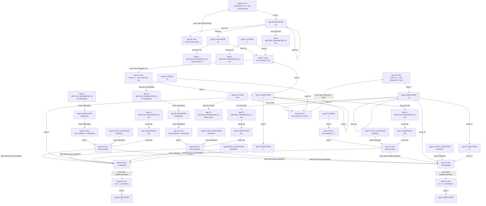

# constructor: spike value graph

```mermaid
flowchart TD
  n0["App:11 METHOD_PARAMETER_IN<br/>ClassParam cp"]
  n1["App:11 METHOD_PARAMETER_IN<br/>int v"]
  n2["App:11 METHOD_PARAMETER_IN<br/>this"]
  n3["App:12 CALL<br/>this.memberX"]
  n4["App:12 CALL<br/>this.memberX = 7"]
  n5["App:12 FIELD_IDENTIFIER<br/>memberX"]
  n6["App:12 IDENTIFIER<br/>this"]
  n7["App:12 LITERAL<br/>7"]
  n8["App:15 METHOD_PARAMETER_IN<br/>int initialValue"]
  n9["App:15 METHOD_PARAMETER_IN<br/>this"]
  n10["App:16 CALL<br/>this.memberX"]
  n11["App:16 CALL<br/>this.memberX = initialValue"]
  n12["App:16 FIELD_IDENTIFIER<br/>memberX"]
  n13["App:16 IDENTIFIER<br/>initialValue"]
  n14["App:16 IDENTIFIER<br/>this"]
  n15["App:19 METHOD_PARAMETER_IN<br/>String name"]
  n16["App:19 METHOD_PARAMETER_IN<br/>int initialValue"]
  n17["App:19 METHOD_PARAMETER_IN<br/>this"]
  n18["App:20 CALL<br/>this.memberX"]
  n19["App:20 CALL<br/>this.memberX = initialValue"]
  n20["App:20 FIELD_IDENTIFIER<br/>memberX"]
  n21["App:20 IDENTIFIER<br/>initialValue"]
  n22["App:20 IDENTIFIER<br/>this"]
  n23["App:26 CALL<br/>ClassParam cp = new ClassParam()"]
  n24["App:26 CALL<br/>new ClassParam()"]
  n25["App:26 IDENTIFIER<br/>cp"]
  n26["App:27 CALL<br/>ClassX x = new ClassX(5, cp)"]
  n27["App:27 CALL<br/>new ClassX(5, cp)"]
  n28["App:27 IDENTIFIER<br/>cp"]
  n29["App:27 IDENTIFIER<br/>x"]
  n30["App:27 LITERAL<br/>5"]
  n31["App:28 CALL<br/>int b = x.memberX"]
  n32["App:28 CALL<br/>x.memberX"]
  n33["App:28 FIELD_IDENTIFIER<br/>memberX"]
  n34["App:28 IDENTIFIER<br/>b"]
  n35["App:28 IDENTIFIER<br/>x"]
  n36["App:30 CALL<br/>ClassX x2 = new ClassX(13, #quot;test#quot;)"]
  n37["App:30 CALL<br/>new ClassX(13, #quot;test#quot;)"]
  n38["App:30 IDENTIFIER<br/>x2"]
  n39["App:30 LITERAL<br/>#quot;test#quot;"]
  n40["App:30 LITERAL<br/>13"]
  n41["App:31 CALL<br/>int c = x2.memberX"]
  n42["App:31 CALL<br/>x2.memberX"]
  n43["App:31 FIELD_IDENTIFIER<br/>memberX"]
  n44["App:31 IDENTIFIER<br/>c"]
  n45["App:31 IDENTIFIER<br/>x2"]
  n46["App:6 METHOD_PARAMETER_IN<br/>this"]
  n10 -->|"field: field ClassX.memberX"| n32
  n10 -->|"field: field ClassX.memberX"| n42
  n11 -->|"local: ="| n10
  n12 -->|"local: memberX"| n10
  n13 -->|"local: initialValue"| n11
  n14 -->|"local: this"| n10
  n16 -->|"local: initialValue"| n21
  n17 -->|"local: this"| n22
  n18 -->|"field: field ClassX.memberX"| n32
  n18 -->|"field: field ClassX.memberX"| n42
  n19 -->|"local: ="| n18
  n2 -->|"local: this"| n6
  n20 -->|"local: memberX"| n18
  n21 -->|"local: initialValue"| n19
  n22 -->|"local: this"| n18
  n23 -->|"local: ="| n25
  n24 -->|"local: new ClassParam()"| n23
  n25 -->|"arg: arg 0 this"| n46
  n25 -->|"local: cp"| n24
  n25 -->|"local: cp"| n25
  n25 -->|"local: cp"| n28
  n26 -->|"local: ="| n29
  n27 -->|"local: new ClassX(5, cp)"| n26
  n28 -->|"arg: arg 2 cp"| n0
  n28 -->|"local: cp"| n27
  n29 -->|"arg: arg 0 this"| n2
  n29 -->|"local: x"| n27
  n29 -->|"local: x"| n29
  n29 -->|"local: x"| n32
  n29 -->|"local: x"| n35
  n3 -->|"field: field ClassX.memberX"| n32
  n3 -->|"field: field ClassX.memberX"| n42
  n30 -->|"arg: arg 1 v"| n1
  n30 -->|"local: 5"| n27
  n31 -->|"local: ="| n34
  n32 -->|"local: field ClassX.memberX"| n31
  n33 -->|"local: memberX"| n32
  n35 -->|"local: x"| n32
  n36 -->|"local: ="| n38
  n37 -->|"local: new ClassX(13, #quot;test#quot;)"| n36
  n38 -->|"arg: arg 0 this"| n17
  n38 -->|"local: x2"| n37
  n38 -->|"local: x2"| n38
  n38 -->|"local: x2"| n42
  n38 -->|"local: x2"| n45
  n39 -->|"arg: arg 2 name"| n15
  n39 -->|"local: #quot;test#quot;"| n37
  n4 -->|"local: ="| n3
  n40 -->|"arg: arg 1 initialValue"| n16
  n40 -->|"local: 13"| n37
  n41 -->|"local: ="| n44
  n42 -->|"local: field ClassX.memberX"| n41
  n43 -->|"local: memberX"| n42
  n45 -->|"local: x2"| n42
  n5 -->|"local: memberX"| n3
  n6 -->|"local: this"| n3
  n7 -->|"local: 7"| n4
  n8 -->|"local: initialValue"| n13
  n9 -->|"local: this"| n14
```
