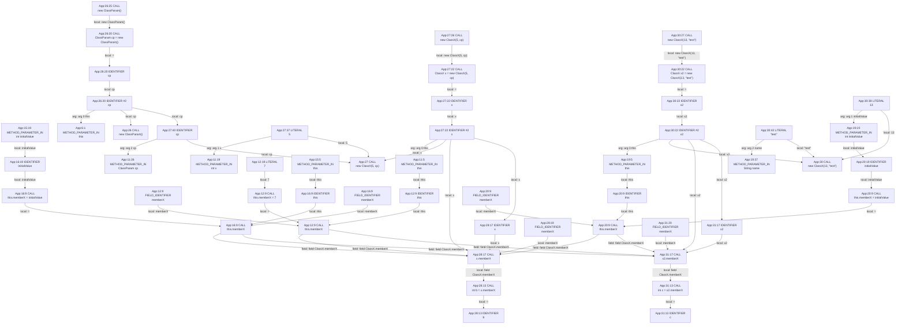

# constructor: spike value graph

```mermaid
flowchart TD
  n0["App:11:19 METHOD_PARAMETER_IN<br/>int v"]
  n1["App:11:26 METHOD_PARAMETER_IN<br/>ClassParam cp"]
  n2["App:11:5 METHOD_PARAMETER_IN<br/>this"]
  n3["App:12:19 LITERAL<br/>7"]
  n4["App:12:9 CALL<br/>this.memberX"]
  n5["App:12:9 CALL<br/>this.memberX = 7"]
  n6["App:12:9 FIELD_IDENTIFIER<br/>memberX"]
  n7["App:12:9 IDENTIFIER<br/>this"]
  n8["App:15:19 METHOD_PARAMETER_IN<br/>int initialValue"]
  n9["App:15:5 METHOD_PARAMETER_IN<br/>this"]
  n10["App:16:19 IDENTIFIER<br/>initialValue"]
  n11["App:16:9 CALL<br/>this.memberX"]
  n12["App:16:9 CALL<br/>this.memberX = initialValue"]
  n13["App:16:9 FIELD_IDENTIFIER<br/>memberX"]
  n14["App:16:9 IDENTIFIER<br/>this"]
  n15["App:19:19 METHOD_PARAMETER_IN<br/>int initialValue"]
  n16["App:19:37 METHOD_PARAMETER_IN<br/>String name"]
  n17["App:19:5 METHOD_PARAMETER_IN<br/>this"]
  n18["App:20:19 IDENTIFIER<br/>initialValue"]
  n19["App:20:9 CALL<br/>this.memberX"]
  n20["App:20:9 CALL<br/>this.memberX = initialValue"]
  n21["App:20:9 FIELD_IDENTIFIER<br/>memberX"]
  n22["App:20:9 IDENTIFIER<br/>this"]
  n23["App:26 CALL<br/>new ClassParam()"]
  n24["App:26:20 CALL<br/>ClassParam cp = new ClassParam()"]
  n25["App:26:20 IDENTIFIER #2<br/>cp"]
  n26["App:26:20 IDENTIFIER<br/>cp"]
  n27["App:26:25 CALL<br/>new ClassParam()"]
  n28["App:27 CALL<br/>new ClassX(5, cp)"]
  n29["App:27:22 CALL<br/>ClassX x = new ClassX(5, cp)"]
  n30["App:27:22 IDENTIFIER #2<br/>x"]
  n31["App:27:22 IDENTIFIER<br/>x"]
  n32["App:27:26 CALL<br/>new ClassX(5, cp)"]
  n33["App:27:37 LITERAL<br/>5"]
  n34["App:27:40 IDENTIFIER<br/>cp"]
  n35["App:28:13 CALL<br/>int b = x.memberX"]
  n36["App:28:13 IDENTIFIER<br/>b"]
  n37["App:28:17 CALL<br/>x.memberX"]
  n38["App:28:17 IDENTIFIER<br/>x"]
  n39["App:28:19 FIELD_IDENTIFIER<br/>memberX"]
  n40["App:30 CALL<br/>new ClassX(13, #quot;test#quot;)"]
  n41["App:30:22 CALL<br/>ClassX x2 = new ClassX(13, #quot;test#quot;)"]
  n42["App:30:22 IDENTIFIER #2<br/>x2"]
  n43["App:30:22 IDENTIFIER<br/>x2"]
  n44["App:30:27 CALL<br/>new ClassX(13, #quot;test#quot;)"]
  n45["App:30:38 LITERAL<br/>13"]
  n46["App:30:42 LITERAL<br/>#quot;test#quot;"]
  n47["App:31:13 CALL<br/>int c = x2.memberX"]
  n48["App:31:13 IDENTIFIER<br/>c"]
  n49["App:31:17 CALL<br/>x2.memberX"]
  n50["App:31:17 IDENTIFIER<br/>x2"]
  n51["App:31:20 FIELD_IDENTIFIER<br/>memberX"]
  n52["App:6:1 METHOD_PARAMETER_IN<br/>this"]
  n10 -->|"local: initialValue"| n12
  n11 -->|"field: field ClassX.memberX"| n37
  n11 -->|"field: field ClassX.memberX"| n49
  n12 -->|"local: ="| n11
  n13 -->|"local: memberX"| n11
  n14 -->|"local: this"| n11
  n15 -->|"local: initialValue"| n18
  n17 -->|"local: this"| n22
  n18 -->|"local: initialValue"| n20
  n19 -->|"field: field ClassX.memberX"| n37
  n19 -->|"field: field ClassX.memberX"| n49
  n2 -->|"local: this"| n7
  n20 -->|"local: ="| n19
  n21 -->|"local: memberX"| n19
  n22 -->|"local: this"| n19
  n24 -->|"local: ="| n26
  n25 -->|"arg: arg 0 this"| n52
  n25 -->|"local: cp"| n23
  n25 -->|"local: cp"| n34
  n26 -->|"local: cp"| n25
  n27 -->|"local: new ClassParam()"| n24
  n29 -->|"local: ="| n31
  n3 -->|"local: 7"| n5
  n30 -->|"arg: arg 0 this"| n2
  n30 -->|"local: x"| n28
  n30 -->|"local: x"| n37
  n30 -->|"local: x"| n38
  n31 -->|"local: x"| n30
  n32 -->|"local: new ClassX(5, cp)"| n29
  n33 -->|"arg: arg 1 v"| n0
  n33 -->|"local: 5"| n28
  n34 -->|"arg: arg 2 cp"| n1
  n34 -->|"local: cp"| n28
  n35 -->|"local: ="| n36
  n37 -->|"local: field ClassX.memberX"| n35
  n38 -->|"local: x"| n37
  n39 -->|"local: memberX"| n37
  n4 -->|"field: field ClassX.memberX"| n37
  n4 -->|"field: field ClassX.memberX"| n49
  n41 -->|"local: ="| n43
  n42 -->|"arg: arg 0 this"| n17
  n42 -->|"local: x2"| n40
  n42 -->|"local: x2"| n49
  n42 -->|"local: x2"| n50
  n43 -->|"local: x2"| n42
  n44 -->|"local: new ClassX(13, #quot;test#quot;)"| n41
  n45 -->|"arg: arg 1 initialValue"| n15
  n45 -->|"local: 13"| n40
  n46 -->|"arg: arg 2 name"| n16
  n46 -->|"local: #quot;test#quot;"| n40
  n47 -->|"local: ="| n48
  n49 -->|"local: field ClassX.memberX"| n47
  n5 -->|"local: ="| n4
  n50 -->|"local: x2"| n49
  n51 -->|"local: memberX"| n49
  n6 -->|"local: memberX"| n4
  n7 -->|"local: this"| n4
  n8 -->|"local: initialValue"| n10
  n9 -->|"local: this"| n14
```
