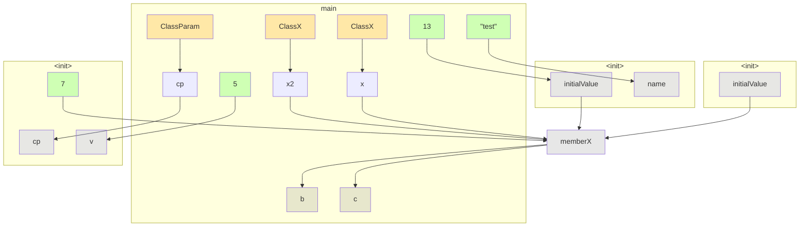

# constructor: spike value graph (condensed)

```mermaid
flowchart TD
  subgraph m0["main"]
    n0["ClassParam"]:::EXTERNAL
    n1["ClassX"]:::EXTERNAL
    n2["ClassX"]:::EXTERNAL
    n3["#quot;test#quot;"]:::LITERAL
    n4["13"]:::LITERAL
    n5["5"]:::LITERAL
    n6["b"]:::VARIABLE
    n7["c"]:::VARIABLE
    n8["cp"]:::OBJ_VARIABLE
    n9["x"]:::OBJ_VARIABLE
    n10["x2"]:::OBJ_VARIABLE
  end
  subgraph m1["#lt;init#gt;"]
    n11["initialValue"]:::FUNC_PARAM
    n12["name"]:::FUNC_PARAM
  end
  subgraph m2["#lt;init#gt;"]
    n13["initialValue"]:::FUNC_PARAM
  end
  subgraph m3["#lt;init#gt;"]
    n14["cp"]:::FUNC_PARAM
    n15["v"]:::FUNC_PARAM
    n16["7"]:::LITERAL
  end
  n17["memberX"]:::VARIABLE
  n0 --> n8
  n1 --> n9
  n10 --> n17
  n11 --> n17
  n13 --> n17
  n16 --> n17
  n17 --> n6
  n17 --> n7
  n2 --> n10
  n3 --> n12
  n4 --> n11
  n5 --> n15
  n8 --> n14
  n9 --> n17
  classDef LITERAL fill:#00FF0030
  classDef VARIABLE fill:#80808030
  classDef BIN_OP fill:#80808080
  classDef FUNC_PARAM fill:#8080FF30
  classDef RETURN fill:#FF808080
  classDef EXTERNAL fill:#FFA50040
  classDef UNMODELLED fill:#FF000030,stroke-dasharray: 4 2
```
