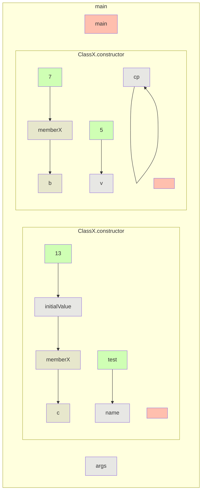

```mermaid
flowchart TD
  subgraph 4309014["main"]
    -1362738615[b]:::VARIABLE
    -1362737701[c]:::VARIABLE
    -1311755417[args]:::FUNC_PARAM
    56853577[main]:::RETURN
    subgraph 1122191319["ClassX.constructor"]
      -658356807[7]:::LITERAL
      -658356513[v]:::FUNC_PARAM
      -658353895[5]:::LITERAL
      -658304414[cp]:::FUNC_PARAM
      14768247883[memberX]:::VARIABLE
      29544965375[<init>]:::RETURN
      -658356807[7]:::LITERAL --> 14768247883[memberX]:::VARIABLE
      -658353895[5]:::LITERAL --> -658356513[v]:::FUNC_PARAM
      -658304414[cp]:::FUNC_PARAM --> -658304414[cp]:::FUNC_PARAM
      14768247883[memberX]:::VARIABLE --> -1362738615[b]:::VARIABLE
    end
    subgraph 1122199459["ClassX.constructor"]
      -7770612242[initialValue]:::FUNC_PARAM
      -658320394[13]:::LITERAL
      -600996877[name]:::FUNC_PARAM
      14768248103[memberX]:::VARIABLE
      17763577222["test"]:::LITERAL
      29544965595[<init>]:::RETURN
      -7770612242[initialValue]:::FUNC_PARAM --> 14768248103[memberX]:::VARIABLE
      -658320394[13]:::LITERAL --> -7770612242[initialValue]:::FUNC_PARAM
      14768248103[memberX]:::VARIABLE --> -1362737701[c]:::VARIABLE
      17763577222["test"]:::LITERAL --> -600996877[name]:::FUNC_PARAM
    end
  end
  classDef LITERAL fill:#00FF0030
  classDef VARIABLE fill:#80808030
  classDef BIN_OP fill:#80808080
  classDef FUNC_PARAM fill:#8080FF30
  classDef RETURN fill:#FF808080
```
