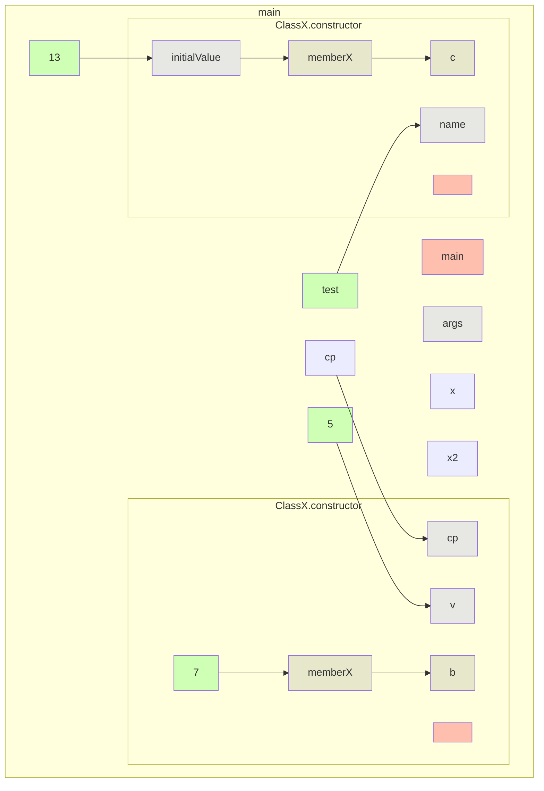

```mermaid
flowchart TD
  subgraph b0["main"]
    n1[main]:::RETURN
    n2[args]:::FUNC_PARAM
    n3[cp]:::OBJ_VARIABLE
    n4[x]:::OBJ_VARIABLE
    n9[5]:::LITERAL
    n12[b]:::VARIABLE
    n13[x2]:::OBJ_VARIABLE
    n18[13]:::LITERAL
    n19["test"]:::LITERAL
    n21[c]:::VARIABLE
    n3[cp]:::OBJ_VARIABLE --> n8[cp]:::FUNC_PARAM
    n9[5]:::LITERAL --> n7[v]:::FUNC_PARAM
    n18[13]:::LITERAL --> n16[initialValue]:::FUNC_PARAM
    n19["test"]:::LITERAL --> n17[name]:::FUNC_PARAM
    subgraph b5["ClassX.constructor"]
      n6[<init>]:::RETURN
      n7[v]:::FUNC_PARAM
      n8[cp]:::FUNC_PARAM
      n10[memberX]:::VARIABLE
      n11[7]:::LITERAL
      n10[memberX]:::VARIABLE --> n12[b]:::VARIABLE
      n11[7]:::LITERAL --> n10[memberX]:::VARIABLE
    end
    subgraph b14["ClassX.constructor"]
      n15[<init>]:::RETURN
      n16[initialValue]:::FUNC_PARAM
      n17[name]:::FUNC_PARAM
      n20[memberX]:::VARIABLE
      n16[initialValue]:::FUNC_PARAM --> n20[memberX]:::VARIABLE
      n20[memberX]:::VARIABLE --> n21[c]:::VARIABLE
    end
  end
  classDef LITERAL fill:#00FF0030
  classDef VARIABLE fill:#80808030
  classDef BIN_OP fill:#80808080
  classDef FUNC_PARAM fill:#8080FF30
  classDef RETURN fill:#FF808080
  classDef EXTERNAL fill:#FFA50040
```
