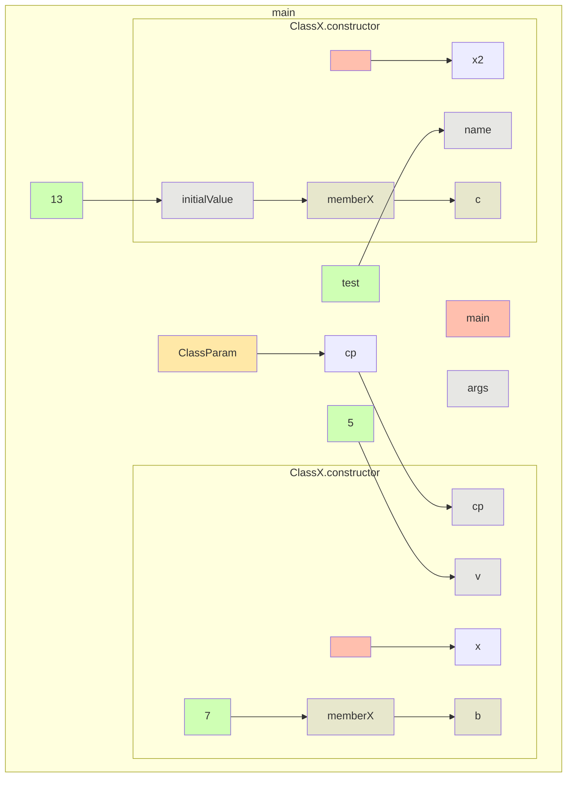

```mermaid
flowchart TD
  subgraph b0["main"]
    n1[main]:::RETURN
    n2[args]:::FUNC_PARAM
    n3[cp]:::OBJ_VARIABLE
    n4[ClassParam]:::EXTERNAL
    n5[x]:::OBJ_VARIABLE
    n6[5]:::LITERAL
    n13[b]:::VARIABLE
    n14[x2]:::OBJ_VARIABLE
    n15[13]:::LITERAL
    n16["test"]:::LITERAL
    n22[c]:::VARIABLE
    n3[cp]:::OBJ_VARIABLE --> n10[cp]:::FUNC_PARAM
    n4[ClassParam]:::EXTERNAL --> n3[cp]:::OBJ_VARIABLE
    n6[5]:::LITERAL --> n9[v]:::FUNC_PARAM
    n15[13]:::LITERAL --> n19[initialValue]:::FUNC_PARAM
    n16["test"]:::LITERAL --> n20[name]:::FUNC_PARAM
    subgraph b7["ClassX.constructor"]
      n8[<init>]:::RETURN
      n9[v]:::FUNC_PARAM
      n10[cp]:::FUNC_PARAM
      n11[memberX]:::VARIABLE
      n12[7]:::LITERAL
      n8[<init>]:::RETURN --> n5[x]:::OBJ_VARIABLE
      n11[memberX]:::VARIABLE --> n13[b]:::VARIABLE
      n12[7]:::LITERAL --> n11[memberX]:::VARIABLE
    end
    subgraph b17["ClassX.constructor"]
      n18[<init>]:::RETURN
      n19[initialValue]:::FUNC_PARAM
      n20[name]:::FUNC_PARAM
      n21[memberX]:::VARIABLE
      n18[<init>]:::RETURN --> n14[x2]:::OBJ_VARIABLE
      n19[initialValue]:::FUNC_PARAM --> n21[memberX]:::VARIABLE
      n21[memberX]:::VARIABLE --> n22[c]:::VARIABLE
    end
  end
  classDef LITERAL fill:#00FF0030
  classDef VARIABLE fill:#80808030
  classDef BIN_OP fill:#80808080
  classDef FUNC_PARAM fill:#8080FF30
  classDef RETURN fill:#FF808080
  classDef EXTERNAL fill:#FFA50040
```
