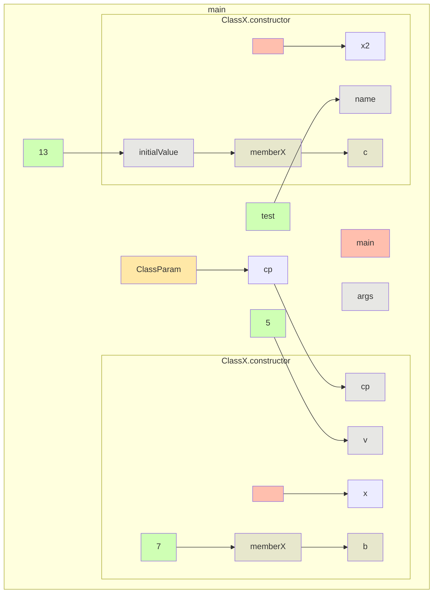

```mermaid
flowchart TD
  subgraph b0["main"]
    n1[main]:::RETURN
    n2[args]:::FUNC_PARAM
    n3[ClassParam]:::EXTERNAL
    n4[cp]:::OBJ_VARIABLE
    n5[5]:::LITERAL
    n12[x]:::OBJ_VARIABLE
    n13[b]:::VARIABLE
    n14[13]:::LITERAL
    n15["test"]:::LITERAL
    n21[x2]:::OBJ_VARIABLE
    n22[c]:::VARIABLE
    n3[ClassParam]:::EXTERNAL --> n4[cp]:::OBJ_VARIABLE
    n4[cp]:::OBJ_VARIABLE --> n9[cp]:::FUNC_PARAM
    n5[5]:::LITERAL --> n8[v]:::FUNC_PARAM
    n14[13]:::LITERAL --> n18[initialValue]:::FUNC_PARAM
    n15["test"]:::LITERAL --> n19[name]:::FUNC_PARAM
    subgraph b6["ClassX.constructor"]
      n7[<init>]:::RETURN
      n8[v]:::FUNC_PARAM
      n9[cp]:::FUNC_PARAM
      n10[7]:::LITERAL
      n11[memberX]:::VARIABLE
      n7[<init>]:::RETURN --> n12[x]:::OBJ_VARIABLE
      n10[7]:::LITERAL --> n11[memberX]:::VARIABLE
      n11[memberX]:::VARIABLE --> n13[b]:::VARIABLE
    end
    subgraph b16["ClassX.constructor"]
      n17[<init>]:::RETURN
      n18[initialValue]:::FUNC_PARAM
      n19[name]:::FUNC_PARAM
      n20[memberX]:::VARIABLE
      n17[<init>]:::RETURN --> n21[x2]:::OBJ_VARIABLE
      n18[initialValue]:::FUNC_PARAM --> n20[memberX]:::VARIABLE
      n20[memberX]:::VARIABLE --> n22[c]:::VARIABLE
    end
  end
  classDef LITERAL fill:#00FF0030
  classDef VARIABLE fill:#80808030
  classDef BIN_OP fill:#80808080
  classDef FUNC_PARAM fill:#8080FF30
  classDef RETURN fill:#FF808080
  classDef EXTERNAL fill:#FFA50040
```
