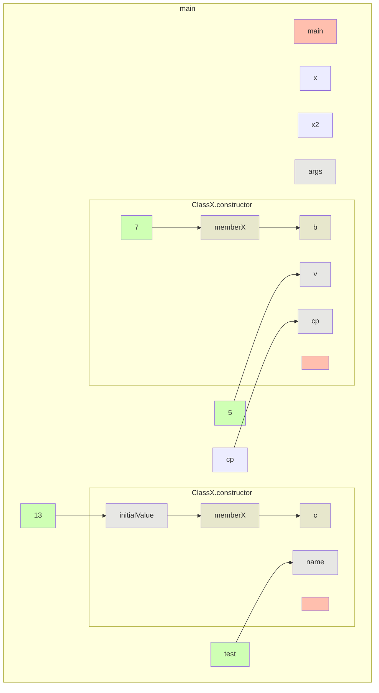

```mermaid
flowchart TD
  subgraph 4309014["main"]
    56853577[main]:::RETURN
    303492807[cp]:::OBJ_VARIABLE
    303494427[x]:::OBJ_VARIABLE
    303521345[5]:::LITERAL
    303527658[b]:::VARIABLE
    303610371[13]:::LITERAL
    303618973[x2]:::OBJ_VARIABLE
    304237851[c]:::VARIABLE
    354416837[args]:::FUNC_PARAM
    18725509039["test"]:::LITERAL
    303492807[cp]:::OBJ_VARIABLE --> 1520911341[cp]:::FUNC_PARAM
    303521345[5]:::LITERAL --> 1520856602[v]:::FUNC_PARAM
    303610371[13]:::LITERAL --> -5988238332[initialValue]:::FUNC_PARAM
    18725509039["test"]:::LITERAL --> 1181382668[name]:::FUNC_PARAM
    subgraph -1651525774["ClassX.constructor"]
      1520856602[v]:::FUNC_PARAM
      1520888980[7]:::LITERAL
      1520911341[cp]:::FUNC_PARAM
      16434485514[memberX]:::VARIABLE
      31211203006[<init>]:::RETURN
      1520888980[7]:::LITERAL --> 16434485514[memberX]:::VARIABLE
      16434485514[memberX]:::VARIABLE --> 303527658[b]:::VARIABLE
    end
    subgraph -1648462470["ClassX.constructor"]
      -5988238332[initialValue]:::FUNC_PARAM
      1181382668[name]:::FUNC_PARAM
      16434568306[memberX]:::VARIABLE
      31211285798[<init>]:::RETURN
      -5988238332[initialValue]:::FUNC_PARAM --> 16434568306[memberX]:::VARIABLE
      16434568306[memberX]:::VARIABLE --> 304237851[c]:::VARIABLE
    end
  end
  classDef LITERAL fill:#00FF0030
  classDef VARIABLE fill:#80808030
  classDef BIN_OP fill:#80808080
  classDef FUNC_PARAM fill:#8080FF30
  classDef RETURN fill:#FF808080
  classDef EXTERNAL fill:#FFA50040
```
