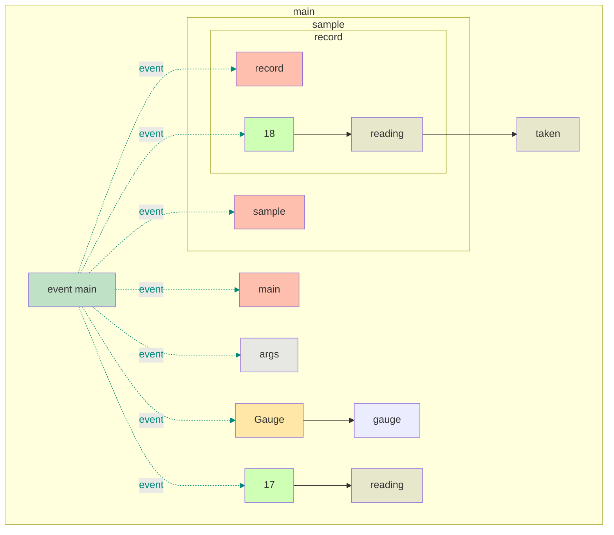

```mermaid
flowchart TD
  subgraph b0["main"]
    n1[event main]:::EVENT
    n2[main]:::RETURN
    n3[args]:::FUNC_PARAM
    n4[Gauge]:::EXTERNAL
    n5[gauge]:::OBJ_VARIABLE
    n6[17]:::LITERAL
    n7[reading]:::VARIABLE
    n14[taken]:::VARIABLE
    n1[event main]:::EVENT -. event .-> n2[main]:::RETURN
    n1[event main]:::EVENT -. event .-> n3[args]:::FUNC_PARAM
    n1[event main]:::EVENT -. event .-> n4[Gauge]:::EXTERNAL
    n1[event main]:::EVENT -. event .-> n6[17]:::LITERAL
    n1[event main]:::EVENT -. event .-> n9[sample]:::RETURN
    n1[event main]:::EVENT -. event .-> n11[record]:::RETURN
    n1[event main]:::EVENT -. event .-> n12[18]:::LITERAL
    n4[Gauge]:::EXTERNAL --> n5[gauge]:::OBJ_VARIABLE
    n6[17]:::LITERAL --> n7[reading]:::VARIABLE
    n13[reading]:::VARIABLE --> n14[taken]:::VARIABLE
    subgraph b8["sample"]
      n9[sample]:::RETURN
      subgraph b10["record"]
        n11[record]:::RETURN
        n12[18]:::LITERAL
        n13[reading]:::VARIABLE
        n12[18]:::LITERAL --> n13[reading]:::VARIABLE
      end
    end
  end
  linkStyle 0 stroke:#00897b,color:#00897b
  linkStyle 1 stroke:#00897b,color:#00897b
  linkStyle 2 stroke:#00897b,color:#00897b
  linkStyle 3 stroke:#00897b,color:#00897b
  linkStyle 4 stroke:#00897b,color:#00897b
  linkStyle 5 stroke:#00897b,color:#00897b
  linkStyle 6 stroke:#00897b,color:#00897b
  classDef LITERAL fill:#00FF0030
  classDef VARIABLE fill:#80808030
  classDef BIN_OP fill:#80808080
  classDef FUNC_PARAM fill:#8080FF30
  classDef RETURN fill:#FF808080
  classDef EXTERNAL fill:#FFA50040
  classDef UNMODELLED fill:#FF000030,stroke-dasharray: 4 2
  classDef EVENT fill:#00897B40
```
