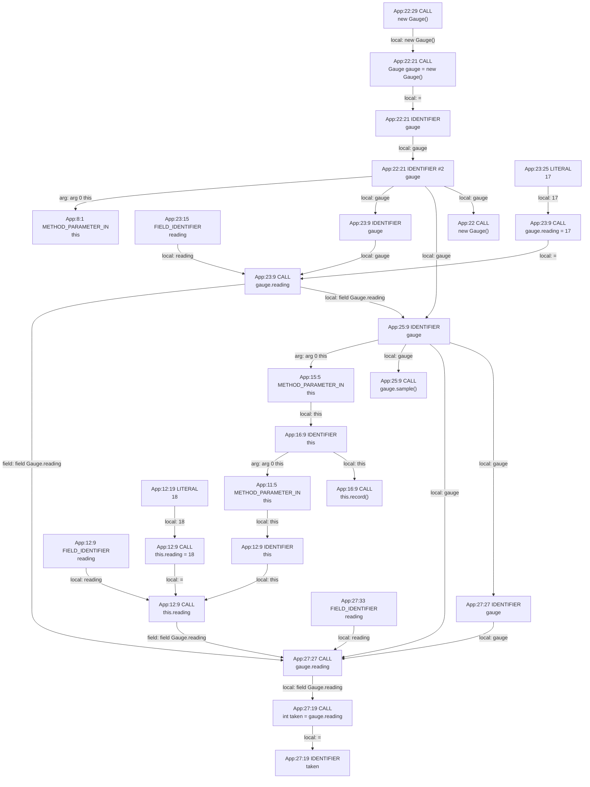

# deepField: spike value graph

```mermaid
flowchart TD
  n0["App:11:5 METHOD_PARAMETER_IN<br/>this"]
  n1["App:12:19 LITERAL<br/>18"]
  n2["App:12:9 CALL<br/>this.reading"]
  n3["App:12:9 CALL<br/>this.reading = 18"]
  n4["App:12:9 FIELD_IDENTIFIER<br/>reading"]
  n5["App:12:9 IDENTIFIER<br/>this"]
  n6["App:15:5 METHOD_PARAMETER_IN<br/>this"]
  n7["App:16:9 CALL<br/>this.record()"]
  n8["App:16:9 IDENTIFIER<br/>this"]
  n9["App:22 CALL<br/>new Gauge()"]
  n10["App:22:21 CALL<br/>Gauge gauge = new Gauge()"]
  n11["App:22:21 IDENTIFIER #2<br/>gauge"]
  n12["App:22:21 IDENTIFIER<br/>gauge"]
  n13["App:22:29 CALL<br/>new Gauge()"]
  n14["App:23:15 FIELD_IDENTIFIER<br/>reading"]
  n15["App:23:25 LITERAL<br/>17"]
  n16["App:23:9 CALL<br/>gauge.reading"]
  n17["App:23:9 CALL<br/>gauge.reading = 17"]
  n18["App:23:9 IDENTIFIER<br/>gauge"]
  n19["App:25:9 CALL<br/>gauge.sample()"]
  n20["App:25:9 IDENTIFIER<br/>gauge"]
  n21["App:27:19 CALL<br/>int taken = gauge.reading"]
  n22["App:27:19 IDENTIFIER<br/>taken"]
  n23["App:27:27 CALL<br/>gauge.reading"]
  n24["App:27:27 IDENTIFIER<br/>gauge"]
  n25["App:27:33 FIELD_IDENTIFIER<br/>reading"]
  n26["App:8:1 METHOD_PARAMETER_IN<br/>this"]
  n0 -->|"local: this"| n5
  n1 -->|"local: 18"| n3
  n10 -->|"local: ="| n12
  n11 -->|"arg: arg 0 this"| n26
  n11 -->|"local: gauge"| n18
  n11 -->|"local: gauge"| n20
  n11 -->|"local: gauge"| n9
  n12 -->|"local: gauge"| n11
  n13 -->|"local: new Gauge()"| n10
  n14 -->|"local: reading"| n16
  n15 -->|"local: 17"| n17
  n16 -->|"field: field Gauge.reading"| n23
  n16 -->|"local: field Gauge.reading"| n20
  n17 -->|"local: ="| n16
  n18 -->|"local: gauge"| n16
  n2 -->|"field: field Gauge.reading"| n23
  n20 -->|"arg: arg 0 this"| n6
  n20 -->|"local: gauge"| n19
  n20 -->|"local: gauge"| n23
  n20 -->|"local: gauge"| n24
  n21 -->|"local: ="| n22
  n23 -->|"local: field Gauge.reading"| n21
  n24 -->|"local: gauge"| n23
  n25 -->|"local: reading"| n23
  n3 -->|"local: ="| n2
  n4 -->|"local: reading"| n2
  n5 -->|"local: this"| n2
  n6 -->|"local: this"| n8
  n8 -->|"arg: arg 0 this"| n0
  n8 -->|"local: this"| n7
```
