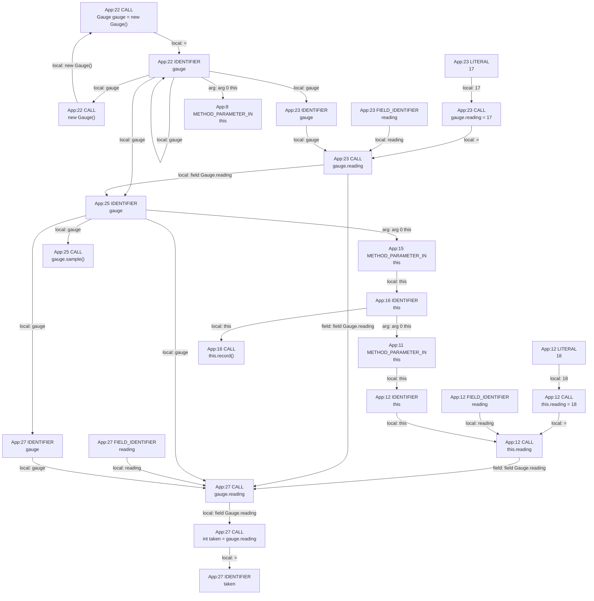

# deepField: spike value graph

```mermaid
flowchart TD
  n0["App:11 METHOD_PARAMETER_IN<br/>this"]
  n1["App:12 CALL<br/>this.reading"]
  n2["App:12 CALL<br/>this.reading = 18"]
  n3["App:12 FIELD_IDENTIFIER<br/>reading"]
  n4["App:12 IDENTIFIER<br/>this"]
  n5["App:12 LITERAL<br/>18"]
  n6["App:15 METHOD_PARAMETER_IN<br/>this"]
  n7["App:16 CALL<br/>this.record()"]
  n8["App:16 IDENTIFIER<br/>this"]
  n9["App:22 CALL<br/>Gauge gauge = new Gauge()"]
  n10["App:22 CALL<br/>new Gauge()"]
  n11["App:22 IDENTIFIER<br/>gauge"]
  n12["App:23 CALL<br/>gauge.reading"]
  n13["App:23 CALL<br/>gauge.reading = 17"]
  n14["App:23 FIELD_IDENTIFIER<br/>reading"]
  n15["App:23 IDENTIFIER<br/>gauge"]
  n16["App:23 LITERAL<br/>17"]
  n17["App:25 CALL<br/>gauge.sample()"]
  n18["App:25 IDENTIFIER<br/>gauge"]
  n19["App:27 CALL<br/>gauge.reading"]
  n20["App:27 CALL<br/>int taken = gauge.reading"]
  n21["App:27 FIELD_IDENTIFIER<br/>reading"]
  n22["App:27 IDENTIFIER<br/>gauge"]
  n23["App:27 IDENTIFIER<br/>taken"]
  n24["App:8 METHOD_PARAMETER_IN<br/>this"]
  n0 -->|"local: this"| n4
  n1 -->|"field: field Gauge.reading"| n19
  n10 -->|"local: new Gauge()"| n9
  n11 -->|"arg: arg 0 this"| n24
  n11 -->|"local: gauge"| n10
  n11 -->|"local: gauge"| n11
  n11 -->|"local: gauge"| n15
  n11 -->|"local: gauge"| n18
  n12 -->|"field: field Gauge.reading"| n19
  n12 -->|"local: field Gauge.reading"| n18
  n13 -->|"local: ="| n12
  n14 -->|"local: reading"| n12
  n15 -->|"local: gauge"| n12
  n16 -->|"local: 17"| n13
  n18 -->|"arg: arg 0 this"| n6
  n18 -->|"local: gauge"| n17
  n18 -->|"local: gauge"| n19
  n18 -->|"local: gauge"| n22
  n19 -->|"local: field Gauge.reading"| n20
  n2 -->|"local: ="| n1
  n20 -->|"local: ="| n23
  n21 -->|"local: reading"| n19
  n22 -->|"local: gauge"| n19
  n3 -->|"local: reading"| n1
  n4 -->|"local: this"| n1
  n5 -->|"local: 18"| n2
  n6 -->|"local: this"| n8
  n8 -->|"arg: arg 0 this"| n0
  n8 -->|"local: this"| n7
  n9 -->|"local: ="| n11
```
