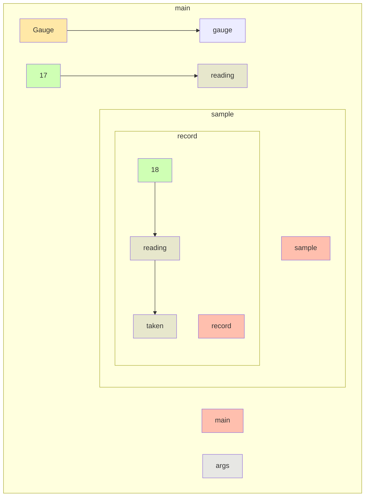

```mermaid
flowchart TD
  subgraph b0["main"]
    n1[main]:::RETURN
    n2[args]:::FUNC_PARAM
    n3[Gauge]:::EXTERNAL
    n4[gauge]:::OBJ_VARIABLE
    n5[17]:::LITERAL
    n6[reading]:::VARIABLE
    n13[taken]:::VARIABLE
    n3[Gauge]:::EXTERNAL --> n4[gauge]:::OBJ_VARIABLE
    n5[17]:::LITERAL --> n6[reading]:::VARIABLE
    subgraph b7["sample"]
      n8[sample]:::RETURN
      subgraph b9["record"]
        n10[record]:::RETURN
        n11[18]:::LITERAL
        n12[reading]:::VARIABLE
        n11[18]:::LITERAL --> n12[reading]:::VARIABLE
        n12[reading]:::VARIABLE --> n13[taken]:::VARIABLE
      end
    end
  end
  classDef LITERAL fill:#00FF0030
  classDef VARIABLE fill:#80808030
  classDef BIN_OP fill:#80808080
  classDef FUNC_PARAM fill:#8080FF30
  classDef RETURN fill:#FF808080
  classDef EXTERNAL fill:#FFA50040
```
