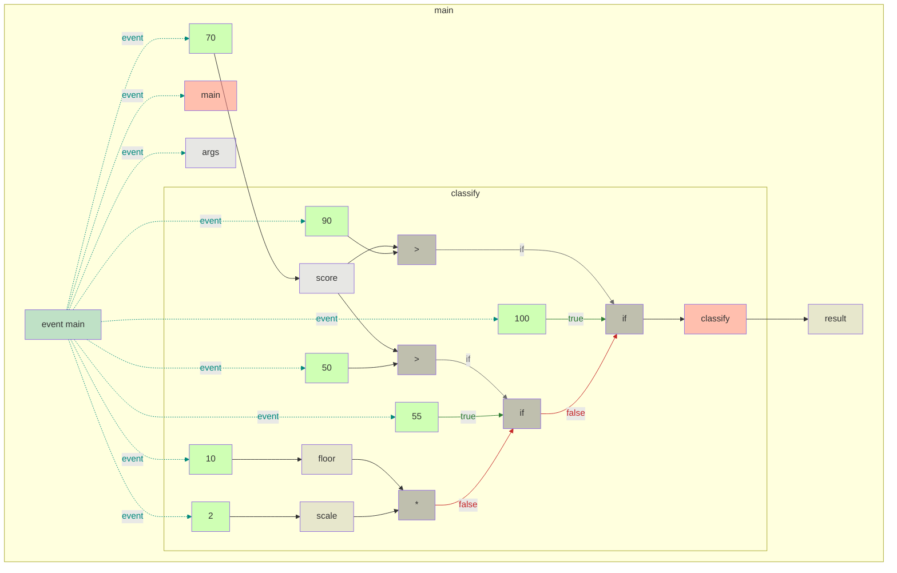

```mermaid
flowchart TD
  subgraph b0["main"]
    n1[event main]:::EVENT
    n2[main]:::RETURN
    n3[args]:::FUNC_PARAM
    n4[70]:::LITERAL
    n21[result]:::VARIABLE
    n1[event main]:::EVENT -. event .-> n2[main]:::RETURN
    n1[event main]:::EVENT -. event .-> n3[args]:::FUNC_PARAM
    n1[event main]:::EVENT -. event .-> n4[70]:::LITERAL
    n1[event main]:::EVENT -. event .-> n8[90]:::LITERAL
    n1[event main]:::EVENT -. event .-> n10[100]:::LITERAL
    n1[event main]:::EVENT -. event .-> n11[50]:::LITERAL
    n1[event main]:::EVENT -. event .-> n13[55]:::LITERAL
    n1[event main]:::EVENT -. event .-> n14[10]:::LITERAL
    n1[event main]:::EVENT -. event .-> n16[2]:::LITERAL
    n4[70]:::LITERAL --> n7[score]:::FUNC_PARAM
    n6[classify]:::RETURN --> n21[result]:::VARIABLE
    subgraph b5["classify"]
      n6[classify]:::RETURN
      n7[score]:::FUNC_PARAM
      n8[90]:::LITERAL
      n9[>]:::BIN_OP
      n10[100]:::LITERAL
      n11[50]:::LITERAL
      n12[>]:::BIN_OP
      n13[55]:::LITERAL
      n14[10]:::LITERAL
      n15[floor]:::VARIABLE
      n16[2]:::LITERAL
      n17[scale]:::VARIABLE
      n18[*]:::BIN_OP
      n19[if]:::BIN_OP
      n20[if]:::BIN_OP
      n7[score]:::FUNC_PARAM --> n9[>]:::BIN_OP
      n7[score]:::FUNC_PARAM --> n12[>]:::BIN_OP
      n8[90]:::LITERAL --> n9[>]:::BIN_OP
      n9[>]:::BIN_OP -->|if| n20[if]:::BIN_OP
      n10[100]:::LITERAL -->|true| n20[if]:::BIN_OP
      n11[50]:::LITERAL --> n12[>]:::BIN_OP
      n12[>]:::BIN_OP -->|if| n19[if]:::BIN_OP
      n13[55]:::LITERAL -->|true| n19[if]:::BIN_OP
      n14[10]:::LITERAL --> n15[floor]:::VARIABLE
      n15[floor]:::VARIABLE --> n18[*]:::BIN_OP
      n16[2]:::LITERAL --> n17[scale]:::VARIABLE
      n17[scale]:::VARIABLE --> n18[*]:::BIN_OP
      n18[*]:::BIN_OP -->|false| n19[if]:::BIN_OP
      n19[if]:::BIN_OP -->|false| n20[if]:::BIN_OP
      n20[if]:::BIN_OP --> n6[classify]:::RETURN
    end
  end
  linkStyle 0 stroke:#00897b,color:#00897b
  linkStyle 1 stroke:#00897b,color:#00897b
  linkStyle 2 stroke:#00897b,color:#00897b
  linkStyle 3 stroke:#00897b,color:#00897b
  linkStyle 4 stroke:#00897b,color:#00897b
  linkStyle 5 stroke:#00897b,color:#00897b
  linkStyle 6 stroke:#00897b,color:#00897b
  linkStyle 7 stroke:#00897b,color:#00897b
  linkStyle 8 stroke:#00897b,color:#00897b
  linkStyle 14 stroke:#6a6a6a,color:#6a6a6a
  linkStyle 15 stroke:#2e7d32,color:#2e7d32
  linkStyle 17 stroke:#6a6a6a,color:#6a6a6a
  linkStyle 18 stroke:#2e7d32,color:#2e7d32
  linkStyle 23 stroke:#c62828,color:#c62828
  linkStyle 24 stroke:#c62828,color:#c62828
  classDef LITERAL fill:#00FF0030
  classDef VARIABLE fill:#80808030
  classDef BIN_OP fill:#80808080
  classDef FUNC_PARAM fill:#8080FF30
  classDef RETURN fill:#FF808080
  classDef EXTERNAL fill:#FFA50040
  classDef UNMODELLED fill:#FF000030,stroke-dasharray: 4 2
  classDef EVENT fill:#00897B40
```
