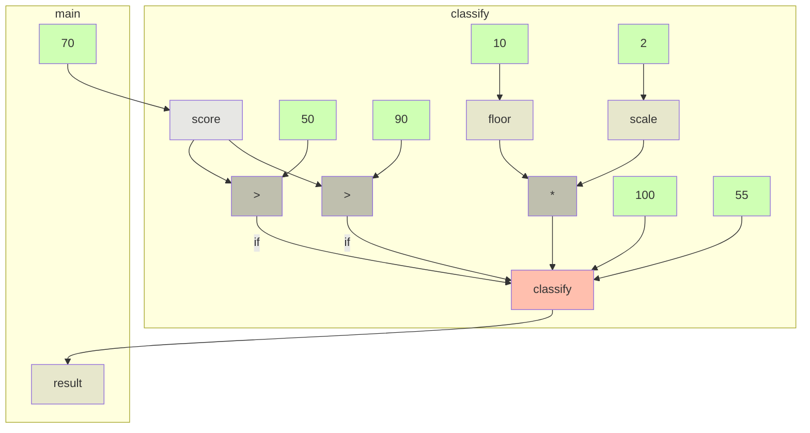

# earlyReturn: spike value graph (condensed)

```mermaid
flowchart TD
  subgraph m0["classify"]
    n0["*"]:::BIN_OP
    n1["#gt;"]:::BIN_OP
    n2["#gt;"]:::BIN_OP
    n3["score"]:::FUNC_PARAM
    n4["100"]:::LITERAL
    n5["10"]:::LITERAL
    n6["2"]:::LITERAL
    n7["50"]:::LITERAL
    n8["55"]:::LITERAL
    n9["90"]:::LITERAL
    n10["classify"]:::RETURN
    n11["floor"]:::VARIABLE
    n12["scale"]:::VARIABLE
  end
  subgraph m1["main"]
    n13["70"]:::LITERAL
    n14["result"]:::VARIABLE
  end
  n0 --> n10
  n1 -->|if| n10
  n10 --> n14
  n11 --> n0
  n12 --> n0
  n13 --> n3
  n2 -->|if| n10
  n3 --> n1
  n3 --> n2
  n4 --> n10
  n5 --> n11
  n6 --> n12
  n7 --> n1
  n8 --> n10
  n9 --> n2
  classDef LITERAL fill:#00FF0030
  classDef VARIABLE fill:#80808030
  classDef BIN_OP fill:#80808080
  classDef FUNC_PARAM fill:#8080FF30
  classDef RETURN fill:#FF808080
  classDef EXTERNAL fill:#FFA50040
  classDef UNMODELLED fill:#FF000030,stroke-dasharray: 4 2
```
