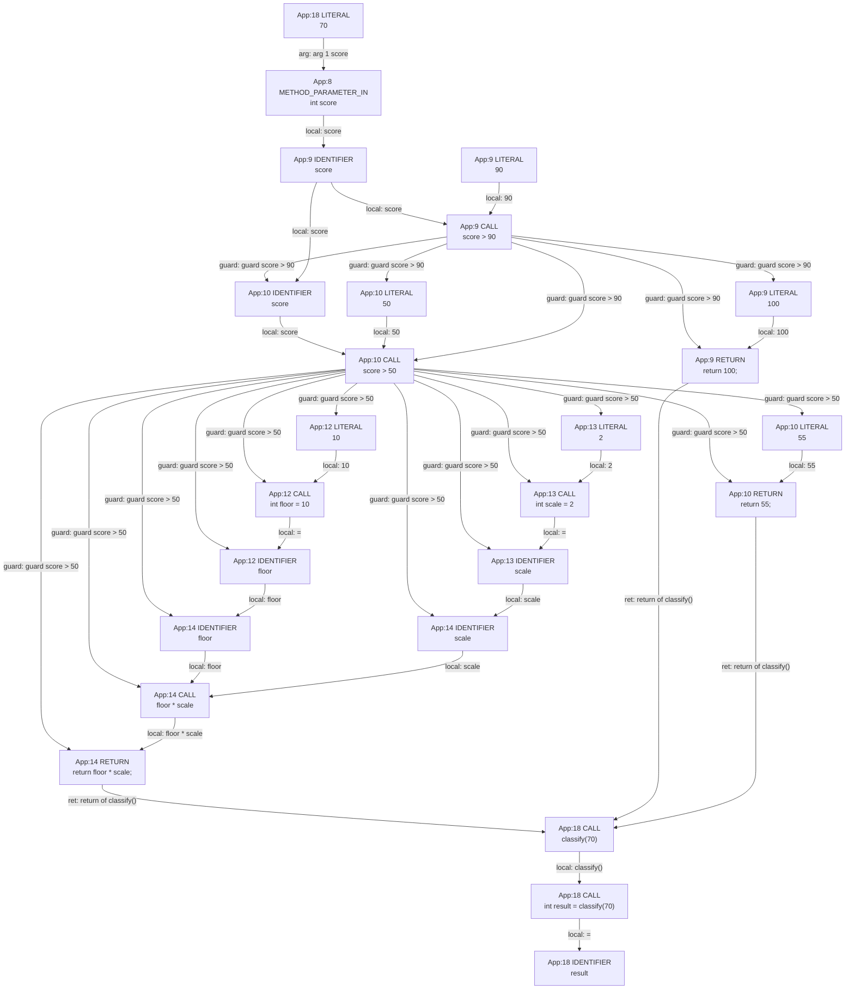

# earlyReturn: spike value graph

```mermaid
flowchart TD
  n0["App:10 CALL<br/>score #gt; 50"]
  n1["App:10 IDENTIFIER<br/>score"]
  n2["App:10 LITERAL<br/>50"]
  n3["App:10 LITERAL<br/>55"]
  n4["App:10 RETURN<br/>return 55;"]
  n5["App:12 CALL<br/>int floor = 10"]
  n6["App:12 IDENTIFIER<br/>floor"]
  n7["App:12 LITERAL<br/>10"]
  n8["App:13 CALL<br/>int scale = 2"]
  n9["App:13 IDENTIFIER<br/>scale"]
  n10["App:13 LITERAL<br/>2"]
  n11["App:14 CALL<br/>floor * scale"]
  n12["App:14 IDENTIFIER<br/>floor"]
  n13["App:14 IDENTIFIER<br/>scale"]
  n14["App:14 RETURN<br/>return floor * scale;"]
  n15["App:18 CALL<br/>classify(70)"]
  n16["App:18 CALL<br/>int result = classify(70)"]
  n17["App:18 IDENTIFIER<br/>result"]
  n18["App:18 LITERAL<br/>70"]
  n19["App:8 METHOD_PARAMETER_IN<br/>int score"]
  n20["App:9 CALL<br/>score #gt; 90"]
  n21["App:9 IDENTIFIER<br/>score"]
  n22["App:9 LITERAL<br/>100"]
  n23["App:9 LITERAL<br/>90"]
  n24["App:9 RETURN<br/>return 100;"]
  n0 -->|"guard: guard score #gt; 50"| n10
  n0 -->|"guard: guard score #gt; 50"| n11
  n0 -->|"guard: guard score #gt; 50"| n12
  n0 -->|"guard: guard score #gt; 50"| n13
  n0 -->|"guard: guard score #gt; 50"| n14
  n0 -->|"guard: guard score #gt; 50"| n3
  n0 -->|"guard: guard score #gt; 50"| n4
  n0 -->|"guard: guard score #gt; 50"| n5
  n0 -->|"guard: guard score #gt; 50"| n6
  n0 -->|"guard: guard score #gt; 50"| n7
  n0 -->|"guard: guard score #gt; 50"| n8
  n0 -->|"guard: guard score #gt; 50"| n9
  n1 -->|"local: score"| n0
  n10 -->|"local: 2"| n8
  n11 -->|"local: floor * scale"| n14
  n12 -->|"local: floor"| n11
  n13 -->|"local: scale"| n11
  n14 -->|"ret: return of classify()"| n15
  n15 -->|"local: classify()"| n16
  n16 -->|"local: ="| n17
  n18 -->|"arg: arg 1 score"| n19
  n19 -->|"local: score"| n21
  n2 -->|"local: 50"| n0
  n20 -->|"guard: guard score #gt; 90"| n0
  n20 -->|"guard: guard score #gt; 90"| n1
  n20 -->|"guard: guard score #gt; 90"| n2
  n20 -->|"guard: guard score #gt; 90"| n22
  n20 -->|"guard: guard score #gt; 90"| n24
  n21 -->|"local: score"| n1
  n21 -->|"local: score"| n20
  n22 -->|"local: 100"| n24
  n23 -->|"local: 90"| n20
  n24 -->|"ret: return of classify()"| n15
  n3 -->|"local: 55"| n4
  n4 -->|"ret: return of classify()"| n15
  n5 -->|"local: ="| n6
  n6 -->|"local: floor"| n12
  n7 -->|"local: 10"| n5
  n8 -->|"local: ="| n9
  n9 -->|"local: scale"| n13
```
