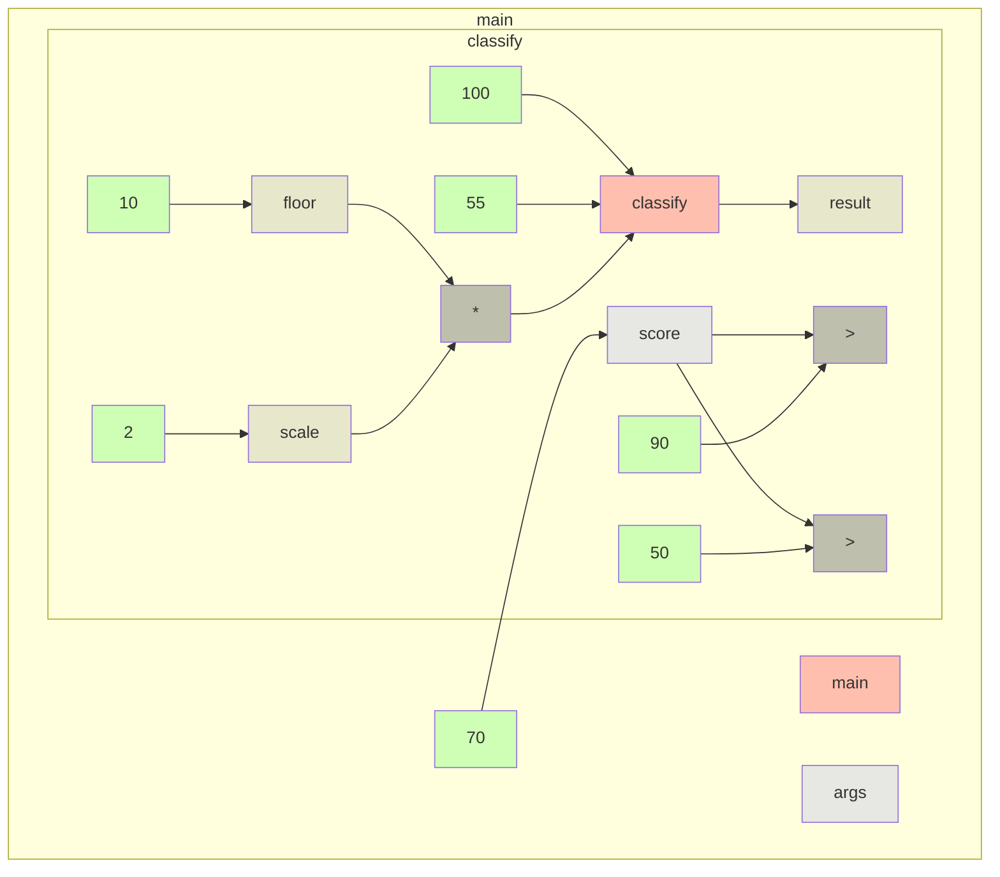

```mermaid
flowchart TD
  subgraph b0["main"]
    n1[main]:::RETURN
    n2[args]:::FUNC_PARAM
    n3[70]:::LITERAL
    n18[result]:::VARIABLE
    n3[70]:::LITERAL --> n6[score]:::FUNC_PARAM
    subgraph b4["classify"]
      n5[classify]:::RETURN
      n6[score]:::FUNC_PARAM
      n7[90]:::LITERAL
      n8[>]:::BIN_OP
      n9[100]:::LITERAL
      n10[50]:::LITERAL
      n11[>]:::BIN_OP
      n12[55]:::LITERAL
      n13[10]:::LITERAL
      n14[floor]:::VARIABLE
      n15[2]:::LITERAL
      n16[scale]:::VARIABLE
      n17[*]:::BIN_OP
      n5[classify]:::RETURN --> n18[result]:::VARIABLE
      n6[score]:::FUNC_PARAM --> n8[>]:::BIN_OP
      n6[score]:::FUNC_PARAM --> n11[>]:::BIN_OP
      n7[90]:::LITERAL --> n8[>]:::BIN_OP
      n9[100]:::LITERAL --> n5[classify]:::RETURN
      n10[50]:::LITERAL --> n11[>]:::BIN_OP
      n12[55]:::LITERAL --> n5[classify]:::RETURN
      n13[10]:::LITERAL --> n14[floor]:::VARIABLE
      n14[floor]:::VARIABLE --> n17[*]:::BIN_OP
      n15[2]:::LITERAL --> n16[scale]:::VARIABLE
      n16[scale]:::VARIABLE --> n17[*]:::BIN_OP
      n17[*]:::BIN_OP --> n5[classify]:::RETURN
    end
  end
  classDef LITERAL fill:#00FF0030
  classDef VARIABLE fill:#80808030
  classDef BIN_OP fill:#80808080
  classDef FUNC_PARAM fill:#8080FF30
  classDef RETURN fill:#FF808080
  classDef EXTERNAL fill:#FFA50040
```
