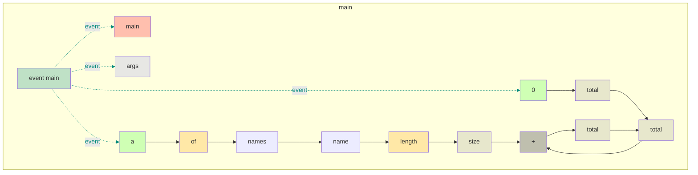

```mermaid
flowchart TD
  subgraph b0["main"]
    n1[event main]:::EVENT
    n2[main]:::RETURN
    n3[args]:::FUNC_PARAM
    n4["a"]:::LITERAL
    n5[of]:::EXTERNAL
    n6[names]:::OBJ_VARIABLE
    n7[0]:::LITERAL
    n8[total]:::VARIABLE
    n9[total]:::VARIABLE
    n10[name]:::OBJ_VARIABLE
    n11[length]:::EXTERNAL
    n12[size]:::VARIABLE
    n13[+]:::BIN_OP
    n14[total]:::VARIABLE
    n1[event main]:::EVENT -. event .-> n2[main]:::RETURN
    n1[event main]:::EVENT -. event .-> n3[args]:::FUNC_PARAM
    n1[event main]:::EVENT -. event .-> n4["a"]:::LITERAL
    n1[event main]:::EVENT -. event .-> n7[0]:::LITERAL
    n4["a"]:::LITERAL --> n5[of]:::EXTERNAL
    n5[of]:::EXTERNAL --> n6[names]:::OBJ_VARIABLE
    n6[names]:::OBJ_VARIABLE --> n10[name]:::OBJ_VARIABLE
    n7[0]:::LITERAL --> n8[total]:::VARIABLE
    n8[total]:::VARIABLE --> n9[total]:::VARIABLE
    n9[total]:::VARIABLE --> n13[+]:::BIN_OP
    n10[name]:::OBJ_VARIABLE --> n11[length]:::EXTERNAL
    n11[length]:::EXTERNAL --> n12[size]:::VARIABLE
    n12[size]:::VARIABLE --> n13[+]:::BIN_OP
    n13[+]:::BIN_OP --> n14[total]:::VARIABLE
    n14[total]:::VARIABLE --> n9[total]:::VARIABLE
  end
  linkStyle 0 stroke:#00897b,color:#00897b
  linkStyle 1 stroke:#00897b,color:#00897b
  linkStyle 2 stroke:#00897b,color:#00897b
  linkStyle 3 stroke:#00897b,color:#00897b
  classDef LITERAL fill:#00FF0030
  classDef VARIABLE fill:#80808030
  classDef BIN_OP fill:#80808080
  classDef FUNC_PARAM fill:#8080FF30
  classDef RETURN fill:#FF808080
  classDef EXTERNAL fill:#FFA50040
  classDef UNMODELLED fill:#FF000030,stroke-dasharray: 4 2
  classDef EVENT fill:#00897B40
```
