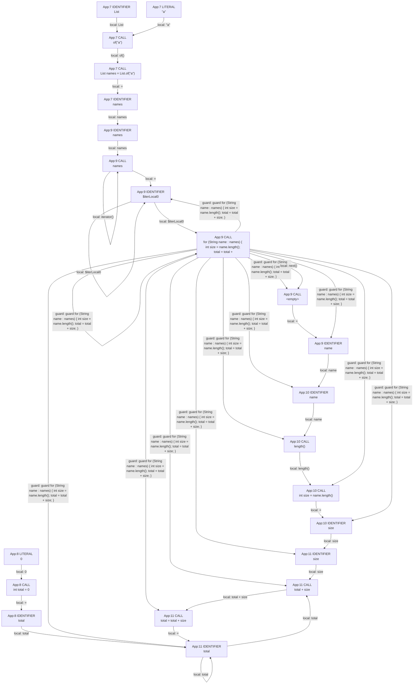

# enhancedFor: spike value graph

```mermaid
flowchart TD
  n0["App:10 CALL<br/>int size = name.length()"]
  n1["App:10 CALL<br/>length()"]
  n2["App:10 IDENTIFIER<br/>name"]
  n3["App:10 IDENTIFIER<br/>size"]
  n4["App:11 CALL<br/>total + size"]
  n5["App:11 CALL<br/>total = total + size"]
  n6["App:11 IDENTIFIER<br/>size"]
  n7["App:11 IDENTIFIER<br/>total"]
  n8["App:7 CALL<br/>List names = List.of(#quot;a#quot;)"]
  n9["App:7 CALL<br/>of(#quot;a#quot;)"]
  n10["App:7 IDENTIFIER<br/>List"]
  n11["App:7 IDENTIFIER<br/>names"]
  n12["App:7 LITERAL<br/>#quot;a#quot;"]
  n13["App:8 CALL<br/>int total = 0"]
  n14["App:8 IDENTIFIER<br/>total"]
  n15["App:8 LITERAL<br/>0"]
  n16["App:9 CALL<br/>#lt;empty#gt;"]
  n17["App:9 CALL<br/>for (String name : names) { int size = name.length(); total = total + "]
  n18["App:9 CALL<br/>names"]
  n19["App:9 IDENTIFIER<br/>$iterLocal0"]
  n20["App:9 IDENTIFIER<br/>name"]
  n21["App:9 IDENTIFIER<br/>names"]
  n0 -->|"local: ="| n3
  n1 -->|"local: length()"| n0
  n10 -->|"local: List"| n9
  n11 -->|"local: names"| n21
  n12 -->|"local: #quot;a#quot;"| n9
  n13 -->|"local: ="| n14
  n14 -->|"local: total"| n7
  n15 -->|"local: 0"| n13
  n16 -->|"local: ="| n20
  n17 -->|"guard: guard for (String name : names) { int size = name.length(); total = total + size; }"| n0
  n17 -->|"guard: guard for (String name : names) { int size = name.length(); total = total + size; }"| n1
  n17 -->|"guard: guard for (String name : names) { int size = name.length(); total = total + size; }"| n16
  n17 -->|"guard: guard for (String name : names) { int size = name.length(); total = total + size; }"| n17
  n17 -->|"guard: guard for (String name : names) { int size = name.length(); total = total + size; }"| n19
  n17 -->|"guard: guard for (String name : names) { int size = name.length(); total = total + size; }"| n2
  n17 -->|"guard: guard for (String name : names) { int size = name.length(); total = total + size; }"| n20
  n17 -->|"guard: guard for (String name : names) { int size = name.length(); total = total + size; }"| n3
  n17 -->|"guard: guard for (String name : names) { int size = name.length(); total = total + size; }"| n4
  n17 -->|"guard: guard for (String name : names) { int size = name.length(); total = total + size; }"| n5
  n17 -->|"guard: guard for (String name : names) { int size = name.length(); total = total + size; }"| n6
  n17 -->|"guard: guard for (String name : names) { int size = name.length(); total = total + size; }"| n7
  n17 -->|"local: next()"| n16
  n18 -->|"local: ="| n19
  n18 -->|"local: iterator()"| n18
  n19 -->|"local: $iterLocal0"| n17
  n19 -->|"local: $iterLocal0"| n19
  n2 -->|"local: name"| n1
  n20 -->|"local: name"| n2
  n21 -->|"local: names"| n18
  n3 -->|"local: size"| n6
  n4 -->|"local: total + size"| n5
  n5 -->|"local: ="| n7
  n6 -->|"local: size"| n4
  n7 -->|"local: total"| n4
  n7 -->|"local: total"| n7
  n8 -->|"local: ="| n11
  n9 -->|"local: of()"| n8
```
