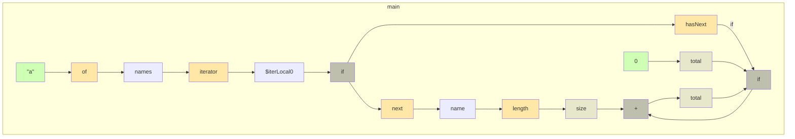

# enhancedFor: spike value graph (condensed)

```mermaid
flowchart TD
  subgraph m0["main"]
    n0["+"]:::BIN_OP
    n1["hasNext"]:::EXTERNAL
    n2["iterator"]:::EXTERNAL
    n3["length"]:::EXTERNAL
    n4["next"]:::EXTERNAL
    n5["of"]:::EXTERNAL
    n6["if"]:::BIN_OP
    n7["if"]:::BIN_OP
    n8["#quot;a#quot;"]:::LITERAL
    n9["0"]:::LITERAL
    n10["$iterLocal0"]:::OBJ_VARIABLE
    n11["names"]:::OBJ_VARIABLE
    n12["name"]:::OBJ_VARIABLE
    n13["size"]:::VARIABLE
    n14["total"]:::VARIABLE
    n15["total"]:::VARIABLE
  end
  n0 --> n14
  n1 -->|if| n6
  n10 --> n7
  n11 --> n2
  n12 --> n3
  n13 --> n0
  n14 --> n6
  n15 --> n6
  n2 --> n10
  n3 --> n13
  n4 --> n12
  n5 --> n11
  n6 --> n0
  n7 --> n1
  n7 --> n4
  n8 --> n5
  n9 --> n15
  classDef LITERAL fill:#00FF0030
  classDef VARIABLE fill:#80808030
  classDef BIN_OP fill:#80808080
  classDef FUNC_PARAM fill:#8080FF30
  classDef RETURN fill:#FF808080
  classDef EXTERNAL fill:#FFA50040
  classDef UNMODELLED fill:#FF000030,stroke-dasharray: 4 2
```
