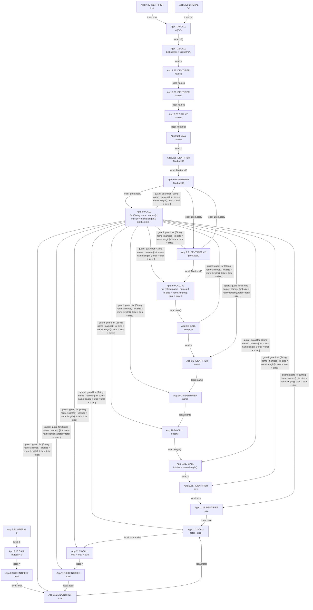

# enhancedFor: spike value graph

```mermaid
flowchart TD
  n0["App:10:17 CALL<br/>int size = name.length()"]
  n1["App:10:17 IDENTIFIER<br/>size"]
  n2["App:10:24 CALL<br/>length()"]
  n3["App:10:24 IDENTIFIER<br/>name"]
  n4["App:11:13 CALL<br/>total = total + size"]
  n5["App:11:13 IDENTIFIER<br/>total"]
  n6["App:11:21 CALL<br/>total + size"]
  n7["App:11:21 IDENTIFIER<br/>total"]
  n8["App:11:29 IDENTIFIER<br/>size"]
  n9["App:7:22 CALL<br/>List names = List.of(#quot;a#quot;)"]
  n10["App:7:22 IDENTIFIER<br/>names"]
  n11["App:7:30 CALL<br/>of(#quot;a#quot;)"]
  n12["App:7:30 IDENTIFIER<br/>List"]
  n13["App:7:38 LITERAL<br/>#quot;a#quot;"]
  n14["App:8:13 CALL<br/>int total = 0"]
  n15["App:8:13 IDENTIFIER<br/>total"]
  n16["App:8:21 LITERAL<br/>0"]
  n17["App:9:28 CALL #2<br/>names"]
  n18["App:9:28 CALL<br/>names"]
  n19["App:9:28 IDENTIFIER<br/>$iterLocal0"]
  n20["App:9:28 IDENTIFIER<br/>names"]
  n21["App:9:9 CALL #2<br/>for (String name : names) { int size = name.length(); total = total + "]
  n22["App:9:9 CALL<br/>#lt;empty#gt;"]
  n23["App:9:9 CALL<br/>for (String name : names) { int size = name.length(); total = total + "]
  n24["App:9:9 IDENTIFIER #2<br/>$iterLocal0"]
  n25["App:9:9 IDENTIFIER<br/>$iterLocal0"]
  n26["App:9:9 IDENTIFIER<br/>name"]
  n0 -->|"local: ="| n1
  n1 -->|"local: size"| n8
  n10 -->|"local: names"| n20
  n11 -->|"local: of()"| n9
  n12 -->|"local: List"| n11
  n13 -->|"local: #quot;a#quot;"| n11
  n14 -->|"local: ="| n15
  n15 -->|"local: total"| n7
  n16 -->|"local: 0"| n14
  n17 -->|"local: iterator()"| n18
  n18 -->|"local: ="| n19
  n19 -->|"local: $iterLocal0"| n25
  n2 -->|"local: length()"| n0
  n20 -->|"local: names"| n17
  n21 -->|"local: next()"| n22
  n22 -->|"local: ="| n26
  n23 -->|"guard: guard for (String name : names) { int size = name.length(); total = total + size; }"| n0
  n23 -->|"guard: guard for (String name : names) { int size = name.length(); total = total + size; }"| n1
  n23 -->|"guard: guard for (String name : names) { int size = name.length(); total = total + size; }"| n2
  n23 -->|"guard: guard for (String name : names) { int size = name.length(); total = total + size; }"| n21
  n23 -->|"guard: guard for (String name : names) { int size = name.length(); total = total + size; }"| n22
  n23 -->|"guard: guard for (String name : names) { int size = name.length(); total = total + size; }"| n24
  n23 -->|"guard: guard for (String name : names) { int size = name.length(); total = total + size; }"| n25
  n23 -->|"guard: guard for (String name : names) { int size = name.length(); total = total + size; }"| n26
  n23 -->|"guard: guard for (String name : names) { int size = name.length(); total = total + size; }"| n3
  n23 -->|"guard: guard for (String name : names) { int size = name.length(); total = total + size; }"| n4
  n23 -->|"guard: guard for (String name : names) { int size = name.length(); total = total + size; }"| n5
  n23 -->|"guard: guard for (String name : names) { int size = name.length(); total = total + size; }"| n6
  n23 -->|"guard: guard for (String name : names) { int size = name.length(); total = total + size; }"| n7
  n23 -->|"guard: guard for (String name : names) { int size = name.length(); total = total + size; }"| n8
  n24 -->|"local: $iterLocal0"| n21
  n24 -->|"local: $iterLocal0"| n25
  n25 -->|"local: $iterLocal0"| n23
  n25 -->|"local: $iterLocal0"| n24
  n26 -->|"local: name"| n3
  n3 -->|"local: name"| n2
  n4 -->|"local: ="| n5
  n5 -->|"local: total"| n7
  n6 -->|"local: total + size"| n4
  n7 -->|"local: total"| n6
  n8 -->|"local: size"| n6
  n9 -->|"local: ="| n10
```
