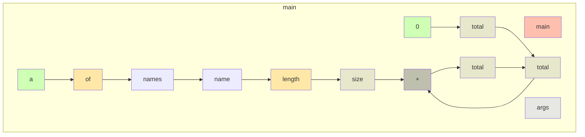

```mermaid
flowchart TD
  subgraph b0["main"]
    n1[main]:::RETURN
    n2[args]:::FUNC_PARAM
    n3["a"]:::LITERAL
    n4[of]:::EXTERNAL
    n5[names]:::OBJ_VARIABLE
    n6[0]:::LITERAL
    n7[total]:::VARIABLE
    n8[total]:::VARIABLE
    n9[name]:::OBJ_VARIABLE
    n10[length]:::EXTERNAL
    n11[size]:::VARIABLE
    n12[+]:::BIN_OP
    n13[total]:::VARIABLE
    n3["a"]:::LITERAL --> n4[of]:::EXTERNAL
    n4[of]:::EXTERNAL --> n5[names]:::OBJ_VARIABLE
    n5[names]:::OBJ_VARIABLE --> n9[name]:::OBJ_VARIABLE
    n6[0]:::LITERAL --> n7[total]:::VARIABLE
    n7[total]:::VARIABLE --> n8[total]:::VARIABLE
    n8[total]:::VARIABLE --> n12[+]:::BIN_OP
    n9[name]:::OBJ_VARIABLE --> n10[length]:::EXTERNAL
    n10[length]:::EXTERNAL --> n11[size]:::VARIABLE
    n11[size]:::VARIABLE --> n12[+]:::BIN_OP
    n12[+]:::BIN_OP --> n13[total]:::VARIABLE
    n13[total]:::VARIABLE --> n8[total]:::VARIABLE
  end
  classDef LITERAL fill:#00FF0030
  classDef VARIABLE fill:#80808030
  classDef BIN_OP fill:#80808080
  classDef FUNC_PARAM fill:#8080FF30
  classDef RETURN fill:#FF808080
  classDef EXTERNAL fill:#FFA50040
  classDef UNMODELLED fill:#FF000030,stroke-dasharray: 4 2
```
