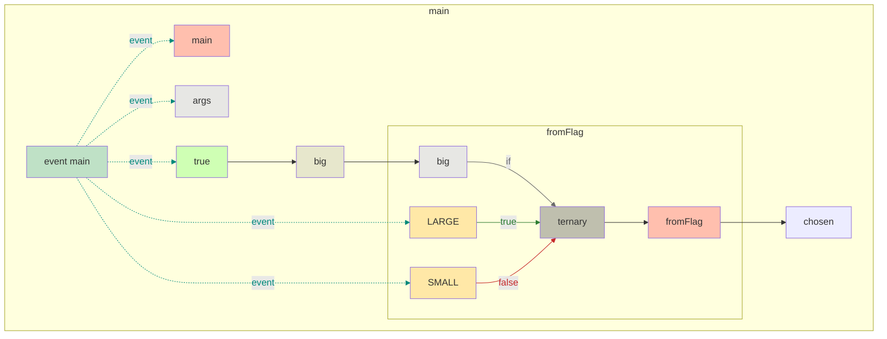

```mermaid
flowchart TD
  subgraph b0["main"]
    n1[event main]:::EVENT
    n2[main]:::RETURN
    n3[args]:::FUNC_PARAM
    n4[true]:::LITERAL
    n5[big]:::VARIABLE
    n12[chosen]:::OBJ_VARIABLE
    n1[event main]:::EVENT -. event .-> n2[main]:::RETURN
    n1[event main]:::EVENT -. event .-> n3[args]:::FUNC_PARAM
    n1[event main]:::EVENT -. event .-> n4[true]:::LITERAL
    n1[event main]:::EVENT -. event .-> n9[LARGE]:::EXTERNAL
    n1[event main]:::EVENT -. event .-> n10[SMALL]:::EXTERNAL
    n4[true]:::LITERAL --> n5[big]:::VARIABLE
    n5[big]:::VARIABLE --> n8[big]:::FUNC_PARAM
    n7[fromFlag]:::RETURN --> n12[chosen]:::OBJ_VARIABLE
    subgraph b6["fromFlag"]
      n7[fromFlag]:::RETURN
      n8[big]:::FUNC_PARAM
      n9[LARGE]:::EXTERNAL
      n10[SMALL]:::EXTERNAL
      n11[ternary]:::BIN_OP
      n8[big]:::FUNC_PARAM -->|if| n11[ternary]:::BIN_OP
      n9[LARGE]:::EXTERNAL -->|true| n11[ternary]:::BIN_OP
      n10[SMALL]:::EXTERNAL -->|false| n11[ternary]:::BIN_OP
      n11[ternary]:::BIN_OP --> n7[fromFlag]:::RETURN
    end
  end
  linkStyle 0 stroke:#00897b,color:#00897b
  linkStyle 1 stroke:#00897b,color:#00897b
  linkStyle 2 stroke:#00897b,color:#00897b
  linkStyle 3 stroke:#00897b,color:#00897b
  linkStyle 4 stroke:#00897b,color:#00897b
  linkStyle 8 stroke:#6a6a6a,color:#6a6a6a
  linkStyle 9 stroke:#2e7d32,color:#2e7d32
  linkStyle 10 stroke:#c62828,color:#c62828
  classDef LITERAL fill:#00FF0030
  classDef VARIABLE fill:#80808030
  classDef BIN_OP fill:#80808080
  classDef FUNC_PARAM fill:#8080FF30
  classDef RETURN fill:#FF808080
  classDef EXTERNAL fill:#FFA50040
  classDef UNMODELLED fill:#FF000030,stroke-dasharray: 4 2
  classDef EVENT fill:#00897B40
```
