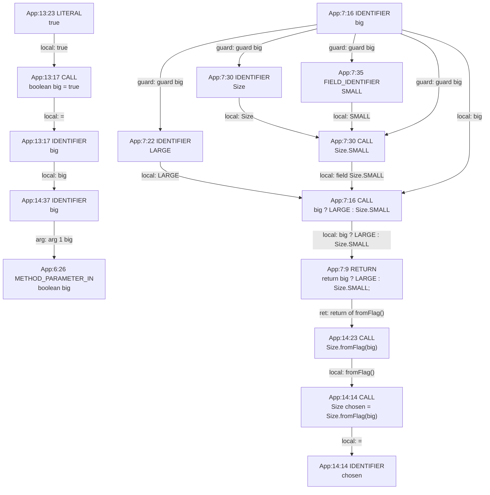

# enumConstant: spike value graph

```mermaid
flowchart TD
  n0["App:13:17 CALL<br/>boolean big = true"]
  n1["App:13:17 IDENTIFIER<br/>big"]
  n2["App:13:23 LITERAL<br/>true"]
  n3["App:14:14 CALL<br/>Size chosen = Size.fromFlag(big)"]
  n4["App:14:14 IDENTIFIER<br/>chosen"]
  n5["App:14:23 CALL<br/>Size.fromFlag(big)"]
  n6["App:14:37 IDENTIFIER<br/>big"]
  n7["App:6:26 METHOD_PARAMETER_IN<br/>boolean big"]
  n8["App:7:16 CALL<br/>big ? LARGE : Size.SMALL"]
  n9["App:7:16 IDENTIFIER<br/>big"]
  n10["App:7:22 IDENTIFIER<br/>LARGE"]
  n11["App:7:30 CALL<br/>Size.SMALL"]
  n12["App:7:30 IDENTIFIER<br/>Size"]
  n13["App:7:35 FIELD_IDENTIFIER<br/>SMALL"]
  n14["App:7:9 RETURN<br/>return big ? LARGE : Size.SMALL;"]
  n0 -->|"local: ="| n1
  n1 -->|"local: big"| n6
  n10 -->|"local: LARGE"| n8
  n11 -->|"local: field Size.SMALL"| n8
  n12 -->|"local: Size"| n11
  n13 -->|"local: SMALL"| n11
  n14 -->|"ret: return of fromFlag()"| n5
  n2 -->|"local: true"| n0
  n3 -->|"local: ="| n4
  n5 -->|"local: fromFlag()"| n3
  n6 -->|"arg: arg 1 big"| n7
  n8 -->|"local: big ? LARGE : Size.SMALL"| n14
  n9 -->|"guard: guard big"| n10
  n9 -->|"guard: guard big"| n11
  n9 -->|"guard: guard big"| n12
  n9 -->|"guard: guard big"| n13
  n9 -->|"local: big"| n8
```
