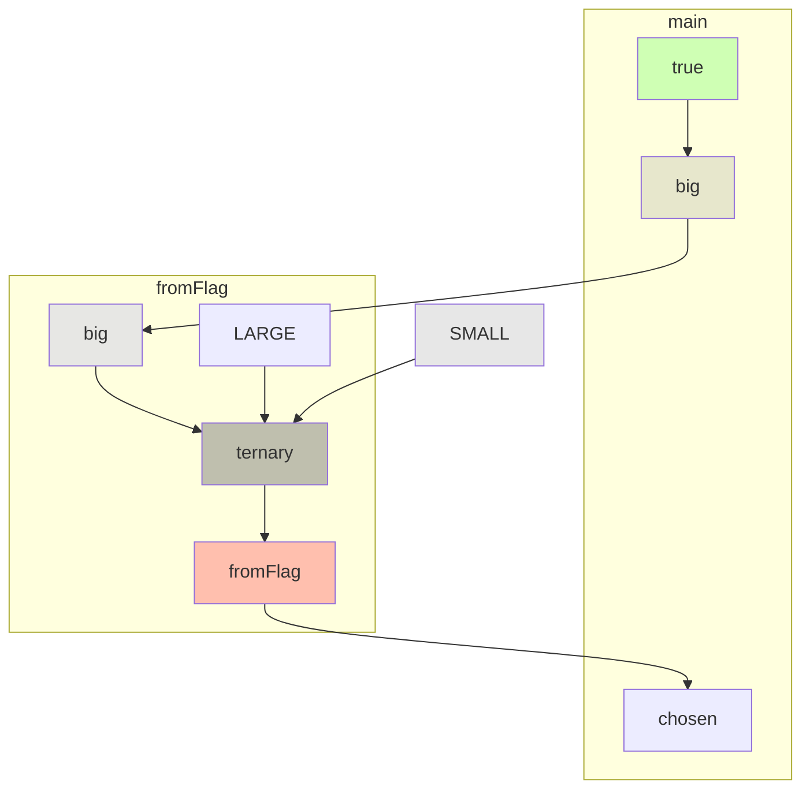

# enumConstant: spike value graph (condensed)

```mermaid
flowchart TD
  subgraph m0["main"]
    n0["true"]:::LITERAL
    n1["chosen"]:::OBJ_VARIABLE
    n2["big"]:::VARIABLE
  end
  subgraph m1["fromFlag"]
    n3["ternary"]:::BIN_OP
    n4["big"]:::FUNC_PARAM
    n5["fromFlag"]:::RETURN
    n6["LARGE"]:::OBJ_VARIABLE
  end
  n7["SMALL"]:::VARIABLE
  n0 --> n2
  n2 --> n4
  n3 --> n5
  n4 --> n3
  n5 --> n1
  n6 --> n3
  n7 --> n3
  classDef LITERAL fill:#00FF0030
  classDef VARIABLE fill:#80808030
  classDef BIN_OP fill:#80808080
  classDef FUNC_PARAM fill:#8080FF30
  classDef RETURN fill:#FF808080
  classDef EXTERNAL fill:#FFA50040
  classDef UNMODELLED fill:#FF000030,stroke-dasharray: 4 2
```
