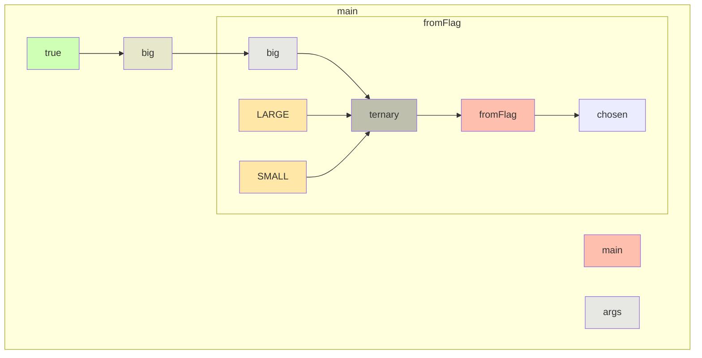

```mermaid
flowchart TD
  subgraph b0["main"]
    n1[main]:::RETURN
    n2[args]:::FUNC_PARAM
    n3[big]:::VARIABLE
    n4[true]:::LITERAL
    n5[chosen]:::OBJ_VARIABLE
    n3[big]:::VARIABLE --> n8[big]:::FUNC_PARAM
    n4[true]:::LITERAL --> n3[big]:::VARIABLE
    subgraph b6["fromFlag"]
      n7[fromFlag]:::RETURN
      n8[big]:::FUNC_PARAM
      n9[LARGE]:::EXTERNAL
      n10[SMALL]:::EXTERNAL
      n11[ternary]:::BIN_OP
      n7[fromFlag]:::RETURN --> n5[chosen]:::OBJ_VARIABLE
      n8[big]:::FUNC_PARAM --> n11[ternary]:::BIN_OP
      n9[LARGE]:::EXTERNAL --> n11[ternary]:::BIN_OP
      n10[SMALL]:::EXTERNAL --> n11[ternary]:::BIN_OP
      n11[ternary]:::BIN_OP --> n7[fromFlag]:::RETURN
    end
  end
  classDef LITERAL fill:#00FF0030
  classDef VARIABLE fill:#80808030
  classDef BIN_OP fill:#80808080
  classDef FUNC_PARAM fill:#8080FF30
  classDef RETURN fill:#FF808080
  classDef EXTERNAL fill:#FFA50040
```
