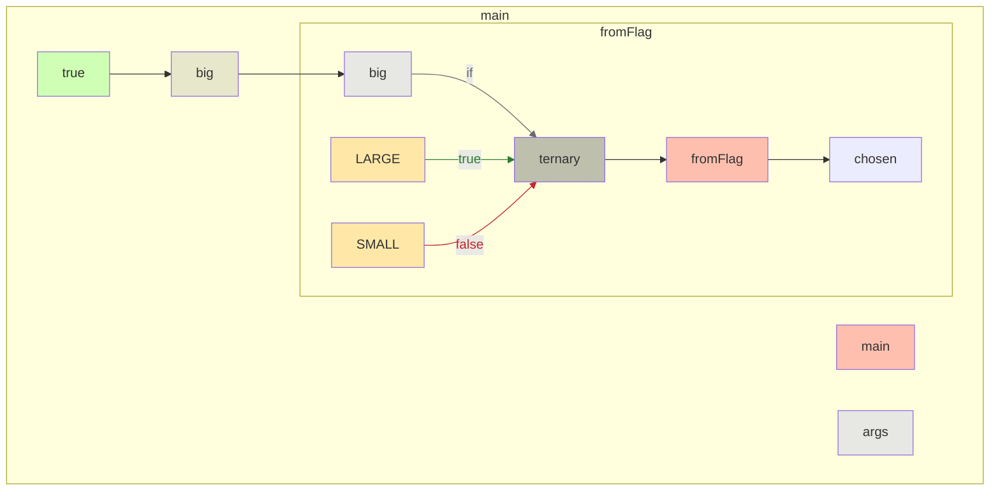

```mermaid
flowchart TD
  subgraph b0["main"]
    n1[main]:::RETURN
    n2[args]:::FUNC_PARAM
    n3[true]:::LITERAL
    n4[big]:::VARIABLE
    n11[chosen]:::OBJ_VARIABLE
    n3[true]:::LITERAL --> n4[big]:::VARIABLE
    n4[big]:::VARIABLE --> n7[big]:::FUNC_PARAM
    subgraph b5["fromFlag"]
      n6[fromFlag]:::RETURN
      n7[big]:::FUNC_PARAM
      n8[LARGE]:::EXTERNAL
      n9[SMALL]:::EXTERNAL
      n10[ternary]:::BIN_OP
      n6[fromFlag]:::RETURN --> n11[chosen]:::OBJ_VARIABLE
      n7[big]:::FUNC_PARAM -->|if| n10[ternary]:::BIN_OP
      n8[LARGE]:::EXTERNAL -->|true| n10[ternary]:::BIN_OP
      n9[SMALL]:::EXTERNAL -->|false| n10[ternary]:::BIN_OP
      n10[ternary]:::BIN_OP --> n6[fromFlag]:::RETURN
    end
  end
  linkStyle 3 stroke:#6a6a6a,color:#6a6a6a
  linkStyle 4 stroke:#2e7d32,color:#2e7d32
  linkStyle 5 stroke:#c62828,color:#c62828
  classDef LITERAL fill:#00FF0030
  classDef VARIABLE fill:#80808030
  classDef BIN_OP fill:#80808080
  classDef FUNC_PARAM fill:#8080FF30
  classDef RETURN fill:#FF808080
  classDef EXTERNAL fill:#FFA50040
  classDef UNMODELLED fill:#FF000030,stroke-dasharray: 4 2
```
