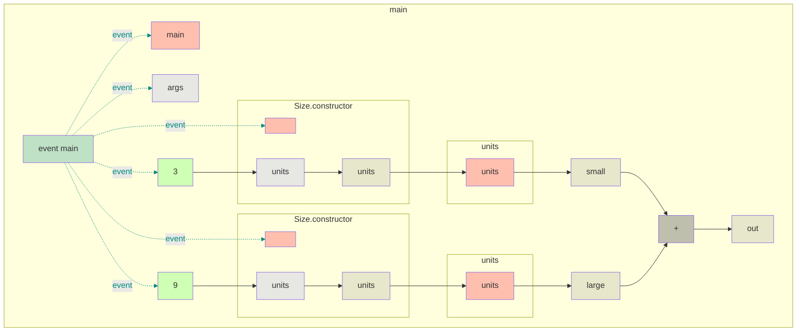

```mermaid
flowchart TD
  subgraph b0["main"]
    n1[event main]:::EVENT
    n2[main]:::RETURN
    n3[args]:::FUNC_PARAM
    n4[3]:::LITERAL
    n11[small]:::VARIABLE
    n12[9]:::LITERAL
    n19[large]:::VARIABLE
    n20[+]:::BIN_OP
    n21[out]:::VARIABLE
    n1[event main]:::EVENT -. event .-> n2[main]:::RETURN
    n1[event main]:::EVENT -. event .-> n3[args]:::FUNC_PARAM
    n1[event main]:::EVENT -. event .-> n4[3]:::LITERAL
    n1[event main]:::EVENT -. event .-> n12[9]:::LITERAL
    n1[event main]:::EVENT -. event .-> n6[<init>]:::RETURN
    n1[event main]:::EVENT -. event .-> n14[<init>]:::RETURN
    n4[3]:::LITERAL --> n7[units]:::FUNC_PARAM
    n11[small]:::VARIABLE --> n20[+]:::BIN_OP
    n12[9]:::LITERAL --> n15[units]:::FUNC_PARAM
    n19[large]:::VARIABLE --> n20[+]:::BIN_OP
    n20[+]:::BIN_OP --> n21[out]:::VARIABLE
    n8[units]:::VARIABLE --> n10[units]:::RETURN
    n10[units]:::RETURN --> n11[small]:::VARIABLE
    n16[units]:::VARIABLE --> n18[units]:::RETURN
    n18[units]:::RETURN --> n19[large]:::VARIABLE
    subgraph b5["Size.constructor"]
      n6[<init>]:::RETURN
      n7[units]:::FUNC_PARAM
      n8[units]:::VARIABLE
      n7[units]:::FUNC_PARAM --> n8[units]:::VARIABLE
    end
    subgraph b9["units"]
      n10[units]:::RETURN
    end
    subgraph b13["Size.constructor"]
      n14[<init>]:::RETURN
      n15[units]:::FUNC_PARAM
      n16[units]:::VARIABLE
      n15[units]:::FUNC_PARAM --> n16[units]:::VARIABLE
    end
    subgraph b17["units"]
      n18[units]:::RETURN
    end
  end
  linkStyle 0 stroke:#00897b,color:#00897b
  linkStyle 1 stroke:#00897b,color:#00897b
  linkStyle 2 stroke:#00897b,color:#00897b
  linkStyle 3 stroke:#00897b,color:#00897b
  linkStyle 4 stroke:#00897b,color:#00897b
  linkStyle 5 stroke:#00897b,color:#00897b
  classDef LITERAL fill:#00FF0030
  classDef VARIABLE fill:#80808030
  classDef BIN_OP fill:#80808080
  classDef FUNC_PARAM fill:#8080FF30
  classDef RETURN fill:#FF808080
  classDef EXTERNAL fill:#FFA50040
  classDef UNMODELLED fill:#FF000030,stroke-dasharray: 4 2
  classDef EVENT fill:#00897B40
```
