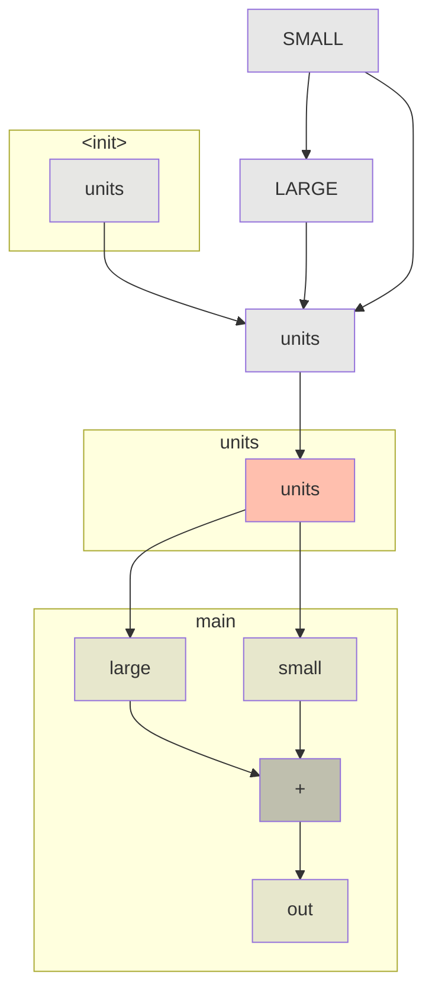

# enumConstructor: spike value graph (condensed)

```mermaid
flowchart TD
  subgraph m0["main"]
    n0["+"]:::BIN_OP
    n1["large"]:::VARIABLE
    n2["out"]:::VARIABLE
    n3["small"]:::VARIABLE
  end
  subgraph m1["#lt;init#gt;"]
    n4["units"]:::FUNC_PARAM
  end
  subgraph m2["units"]
    n5["units"]:::RETURN
  end
  n6["LARGE"]:::VARIABLE
  n7["SMALL"]:::VARIABLE
  n8["units"]:::VARIABLE
  n0 --> n2
  n1 --> n0
  n3 --> n0
  n4 --> n8
  n5 --> n1
  n5 --> n3
  n6 --> n8
  n7 --> n6
  n7 --> n8
  n8 --> n5
  classDef LITERAL fill:#00FF0030
  classDef VARIABLE fill:#80808030
  classDef BIN_OP fill:#80808080
  classDef FUNC_PARAM fill:#8080FF30
  classDef RETURN fill:#FF808080
  classDef EXTERNAL fill:#FFA50040
  classDef UNMODELLED fill:#FF000030,stroke-dasharray: 4 2
```
