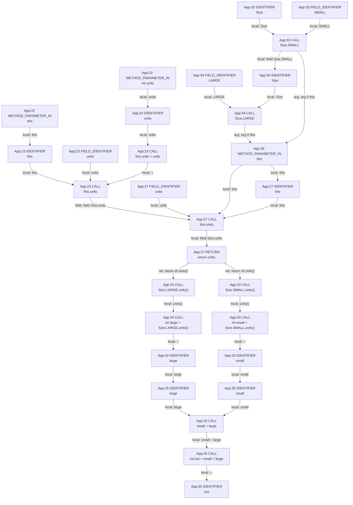

# enumConstructor: spike value graph

```mermaid
flowchart TD
  n0["App:22 METHOD_PARAMETER_IN<br/>int units"]
  n1["App:22 METHOD_PARAMETER_IN<br/>this"]
  n2["App:23 CALL<br/>this.units"]
  n3["App:23 CALL<br/>this.units = units"]
  n4["App:23 FIELD_IDENTIFIER<br/>units"]
  n5["App:23 IDENTIFIER<br/>this"]
  n6["App:23 IDENTIFIER<br/>units"]
  n7["App:26 METHOD_PARAMETER_IN<br/>this"]
  n8["App:27 CALL<br/>this.units"]
  n9["App:27 FIELD_IDENTIFIER<br/>units"]
  n10["App:27 IDENTIFIER<br/>this"]
  n11["App:27 RETURN<br/>return units;"]
  n12["App:33 CALL<br/>Size.SMALL"]
  n13["App:33 CALL<br/>Size.SMALL.units()"]
  n14["App:33 CALL<br/>int small = Size.SMALL.units()"]
  n15["App:33 FIELD_IDENTIFIER<br/>SMALL"]
  n16["App:33 IDENTIFIER<br/>Size"]
  n17["App:33 IDENTIFIER<br/>small"]
  n18["App:34 CALL<br/>Size.LARGE"]
  n19["App:34 CALL<br/>Size.LARGE.units()"]
  n20["App:34 CALL<br/>int large = Size.LARGE.units()"]
  n21["App:34 FIELD_IDENTIFIER<br/>LARGE"]
  n22["App:34 IDENTIFIER<br/>Size"]
  n23["App:34 IDENTIFIER<br/>large"]
  n24["App:35 CALL<br/>int out = small + large"]
  n25["App:35 CALL<br/>small + large"]
  n26["App:35 IDENTIFIER<br/>large"]
  n27["App:35 IDENTIFIER<br/>out"]
  n28["App:35 IDENTIFIER<br/>small"]
  n0 -->|"local: units"| n6
  n1 -->|"local: this"| n5
  n10 -->|"local: this"| n8
  n11 -->|"ret: return of units()"| n13
  n11 -->|"ret: return of units()"| n19
  n12 -->|"arg: arg 0 this"| n7
  n12 -->|"local: field Size.SMALL"| n22
  n13 -->|"local: units()"| n14
  n14 -->|"local: ="| n17
  n15 -->|"local: SMALL"| n12
  n16 -->|"local: Size"| n12
  n17 -->|"local: small"| n28
  n18 -->|"arg: arg 0 this"| n7
  n19 -->|"local: units()"| n20
  n2 -->|"field: field Size.units"| n8
  n20 -->|"local: ="| n23
  n21 -->|"local: LARGE"| n18
  n22 -->|"local: Size"| n18
  n23 -->|"local: large"| n26
  n24 -->|"local: ="| n27
  n25 -->|"local: small + large"| n24
  n26 -->|"local: large"| n25
  n28 -->|"local: small"| n25
  n3 -->|"local: ="| n2
  n4 -->|"local: units"| n2
  n5 -->|"local: this"| n2
  n6 -->|"local: units"| n3
  n7 -->|"local: this"| n10
  n7 -->|"local: this"| n8
  n8 -->|"local: field Size.units"| n11
  n9 -->|"local: units"| n8
```
