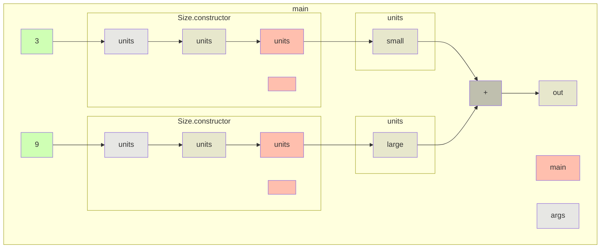

```mermaid
flowchart TD
  subgraph b0["main"]
    n1[main]:::RETURN
    n2[args]:::FUNC_PARAM
    n3[3]:::LITERAL
    n10[small]:::VARIABLE
    n11[9]:::LITERAL
    n18[large]:::VARIABLE
    n19[+]:::BIN_OP
    n20[out]:::VARIABLE
    n3[3]:::LITERAL --> n6[units]:::FUNC_PARAM
    n10[small]:::VARIABLE --> n19[+]:::BIN_OP
    n11[9]:::LITERAL --> n14[units]:::FUNC_PARAM
    n18[large]:::VARIABLE --> n19[+]:::BIN_OP
    n19[+]:::BIN_OP --> n20[out]:::VARIABLE
    subgraph b4["Size.constructor"]
      n5[<init>]:::RETURN
      n6[units]:::FUNC_PARAM
      n7[units]:::VARIABLE
      n6[units]:::FUNC_PARAM --> n7[units]:::VARIABLE
      n7[units]:::VARIABLE --> n9[units]:::RETURN
    end
    subgraph b8["units"]
      n9[units]:::RETURN
      n9[units]:::RETURN --> n10[small]:::VARIABLE
    end
    subgraph b12["Size.constructor"]
      n13[<init>]:::RETURN
      n14[units]:::FUNC_PARAM
      n15[units]:::VARIABLE
      n14[units]:::FUNC_PARAM --> n15[units]:::VARIABLE
      n15[units]:::VARIABLE --> n17[units]:::RETURN
    end
    subgraph b16["units"]
      n17[units]:::RETURN
      n17[units]:::RETURN --> n18[large]:::VARIABLE
    end
  end
  classDef LITERAL fill:#00FF0030
  classDef VARIABLE fill:#80808030
  classDef BIN_OP fill:#80808080
  classDef FUNC_PARAM fill:#8080FF30
  classDef RETURN fill:#FF808080
  classDef EXTERNAL fill:#FFA50040
  classDef UNMODELLED fill:#FF000030,stroke-dasharray: 4 2
```
