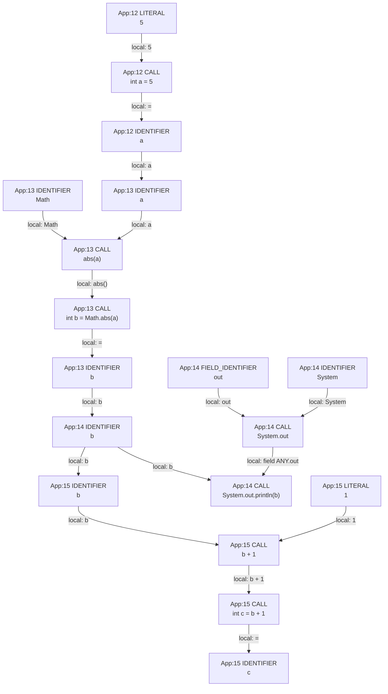

# externalCall: spike value graph

```mermaid
flowchart TD
  n0["App:12 CALL<br/>int a = 5"]
  n1["App:12 IDENTIFIER<br/>a"]
  n2["App:12 LITERAL<br/>5"]
  n3["App:13 CALL<br/>abs(a)"]
  n4["App:13 CALL<br/>int b = Math.abs(a)"]
  n5["App:13 IDENTIFIER<br/>Math"]
  n6["App:13 IDENTIFIER<br/>a"]
  n7["App:13 IDENTIFIER<br/>b"]
  n8["App:14 CALL<br/>System.out"]
  n9["App:14 CALL<br/>System.out.println(b)"]
  n10["App:14 FIELD_IDENTIFIER<br/>out"]
  n11["App:14 IDENTIFIER<br/>System"]
  n12["App:14 IDENTIFIER<br/>b"]
  n13["App:15 CALL<br/>b + 1"]
  n14["App:15 CALL<br/>int c = b + 1"]
  n15["App:15 IDENTIFIER<br/>b"]
  n16["App:15 IDENTIFIER<br/>c"]
  n17["App:15 LITERAL<br/>1"]
  n0 -->|"local: ="| n1
  n1 -->|"local: a"| n6
  n10 -->|"local: out"| n8
  n11 -->|"local: System"| n8
  n12 -->|"local: b"| n15
  n12 -->|"local: b"| n9
  n13 -->|"local: b + 1"| n14
  n14 -->|"local: ="| n16
  n15 -->|"local: b"| n13
  n17 -->|"local: 1"| n13
  n2 -->|"local: 5"| n0
  n3 -->|"local: abs()"| n4
  n4 -->|"local: ="| n7
  n5 -->|"local: Math"| n3
  n6 -->|"local: a"| n3
  n7 -->|"local: b"| n12
  n8 -->|"local: field ANY.out"| n9
```
