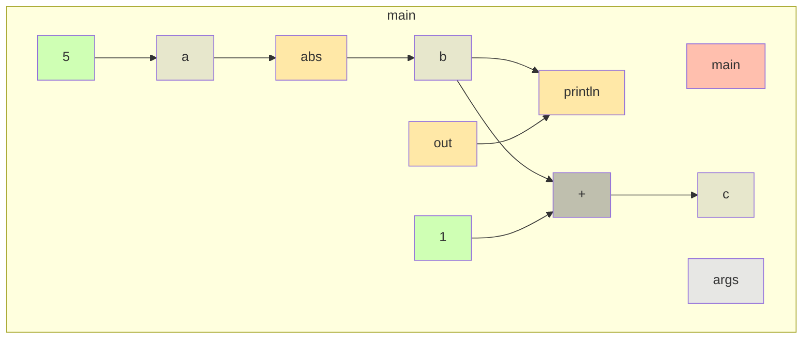

```mermaid
flowchart TD
  subgraph b0["main"]
    n1[main]:::RETURN
    n2[args]:::FUNC_PARAM
    n3[a]:::VARIABLE
    n4[5]:::LITERAL
    n5[b]:::VARIABLE
    n6[abs]:::EXTERNAL
    n7[out]:::EXTERNAL
    n8[println]:::EXTERNAL
    n9[c]:::VARIABLE
    n10[1]:::LITERAL
    n11[+]:::BIN_OP
    n3[a]:::VARIABLE --> n6[abs]:::EXTERNAL
    n4[5]:::LITERAL --> n3[a]:::VARIABLE
    n5[b]:::VARIABLE --> n8[println]:::EXTERNAL
    n5[b]:::VARIABLE --> n11[+]:::BIN_OP
    n6[abs]:::EXTERNAL --> n5[b]:::VARIABLE
    n7[out]:::EXTERNAL --> n8[println]:::EXTERNAL
    n10[1]:::LITERAL --> n11[+]:::BIN_OP
    n11[+]:::BIN_OP --> n9[c]:::VARIABLE
  end
  classDef LITERAL fill:#00FF0030
  classDef VARIABLE fill:#80808030
  classDef BIN_OP fill:#80808080
  classDef FUNC_PARAM fill:#8080FF30
  classDef RETURN fill:#FF808080
  classDef EXTERNAL fill:#FFA50040
```
