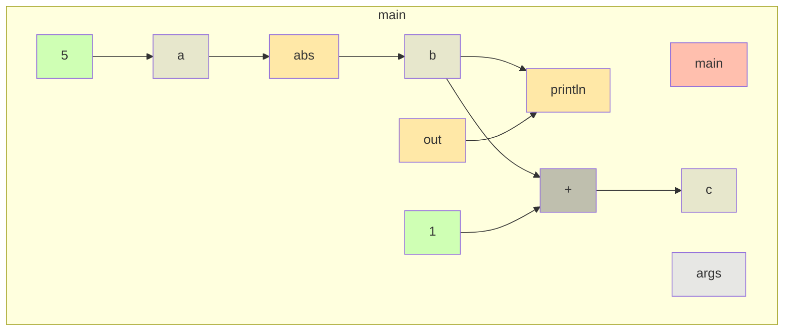

```mermaid
flowchart TD
  subgraph 4309014["main"]
    -7043408724[println]:::EXTERNAL
    -1693260311[a]:::VARIABLE
    -1693257119[5]:::LITERAL
    -1693232394[b]:::VARIABLE
    -1693171807[c]:::VARIABLE
    -1693168168[+]:::BIN_OP
    -1693167039[1]:::LITERAL
    -1691591830[abs]:::EXTERNAL
    -1691326245[out]:::EXTERNAL
    -1642303975[args]:::FUNC_PARAM
    56853577[main]:::RETURN
    -1693260311[a]:::VARIABLE --> -1691591830[abs]:::EXTERNAL
    -1693257119[5]:::LITERAL --> -1693260311[a]:::VARIABLE
    -1693232394[b]:::VARIABLE --> -7043408724[println]:::EXTERNAL
    -1693232394[b]:::VARIABLE --> -1693168168[+]:::BIN_OP
    -1693168168[+]:::BIN_OP --> -1693171807[c]:::VARIABLE
    -1693167039[1]:::LITERAL --> -1693168168[+]:::BIN_OP
    -1691591830[abs]:::EXTERNAL --> -1693232394[b]:::VARIABLE
    -1691326245[out]:::EXTERNAL --> -7043408724[println]:::EXTERNAL
  end
  classDef LITERAL fill:#00FF0030
  classDef VARIABLE fill:#80808030
  classDef BIN_OP fill:#80808080
  classDef FUNC_PARAM fill:#8080FF30
  classDef RETURN fill:#FF808080
  classDef EXTERNAL fill:#FFA50040
```
