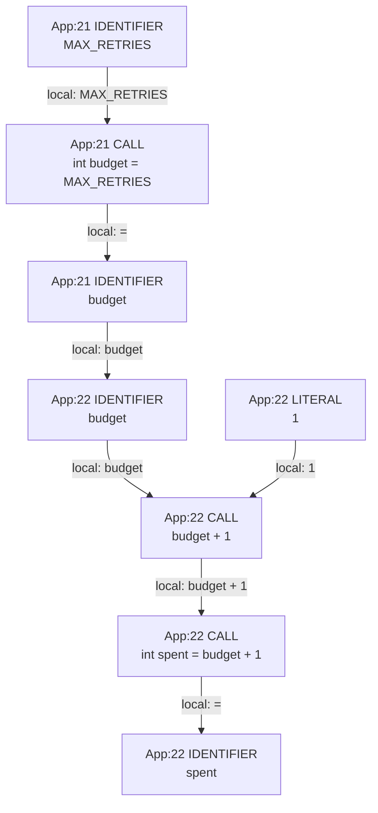

# externalConstant: spike value graph

```mermaid
flowchart TD
  n0["App:21 CALL<br/>int budget = MAX_RETRIES"]
  n1["App:21 IDENTIFIER<br/>MAX_RETRIES"]
  n2["App:21 IDENTIFIER<br/>budget"]
  n3["App:22 CALL<br/>budget + 1"]
  n4["App:22 CALL<br/>int spent = budget + 1"]
  n5["App:22 IDENTIFIER<br/>budget"]
  n6["App:22 IDENTIFIER<br/>spent"]
  n7["App:22 LITERAL<br/>1"]
  n0 -->|"local: ="| n2
  n1 -->|"local: MAX_RETRIES"| n0
  n2 -->|"local: budget"| n5
  n3 -->|"local: budget + 1"| n4
  n4 -->|"local: ="| n6
  n5 -->|"local: budget"| n3
  n7 -->|"local: 1"| n3
```
